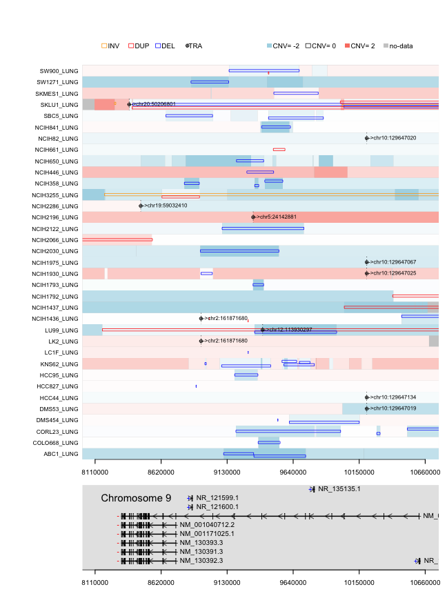

<script type="text/javascript">
document.addEventListener("DOMContentLoaded", function() {
  document.querySelector("h1").className = "title";
});
</script>
<script type="text/javascript">
document.addEventListener("DOMContentLoaded", function() {
  var links = document.links;  
  for (var i = 0, linksLength = links.length; i < linksLength; i++)
    if (links[i].hostname != window.location.hostname)
      links[i].target = '_blank';
});
</script>
<style type="text/css" scoped>
body {
  margin: 0px auto;
  max-width: 1134px;
  font-family: sans-serif;
  font-size: 10pt;
}

/* Table of contents style */

div#TOC ul {
  padding: 0px 0px 0px 45px;
  list-style: none;
  background-image: none;
  background-repeat: none;
  background-position: 0;
  font-size: 10pt;
  font-family: Helvetica, Arial, sans-serif;
}

div#TOC > ul {
  padding: 0px 150px 0px 65px;
  font-size: 12pt;
}

div#TOC > ul > li {
  padding: 5px 0px 0px 0px;
}

div#TOC ul ul {
  font-size: 11pt;
}

div#TOC.tocify ul {
  padding: 0px;
  font-size: inherit;
  font-family: inherit;
}

div#TOC.tocify li {
  padding: 5px;
  font-size: inherit;
  font-family: inherit;
}

p, dl {
  padding: 0px 150px 0px 65px;
  text-align: justify;
}

/* vertical content spacing */
p, img, table {
  margin-top: 10px;
  margin-bottom: 10px;
}

/* lists */
ol, ul {
  padding: 0px 150px 0px 100px;
  list-style: square;
}

li ol, li ul {
  padding: 0px 0px 0px 35px;
}

li p {
  padding: 0;
}

pre {
  margin: 0em 150px 0.5em 0em;
  padding: 0px 0px 0px 65px;
  border: 0px none;
  background-color: #f0f0f0;
  white-space: pre;
  overflow-x: auto;
  font-size: 90%;
}

li pre {
  margin: 0em 0px 0.5em -65px;
  padding: 0px 0px 0px 65px;
}
pre code {
  background-color: inherit;
  display: block;
  padding: 10px 10px 10px 0px;
  overflow-x: inherit;
  font-size: 100%;
}

/* markdown v1 */
pre code[class] {
  background-color: inherit;
}

/* markdown v2 */
pre[class] code {
  background-color: inherit;
}

tt, code, pre {
   font-family: 'DejaVu Sans Mono', 'Droid Sans Mono', 'Lucida Console', Consolas, Monaco, monospace;
}

h1, h2, h3, h4, h5, h6 { 
  font-family: Helvetica, Arial, sans-serif;
  margin: 1.2em 150px 0.6em 0em;
/* hanging headings */
  padding-left: 65px;
  text-indent: -65px;
}

h1.title {
  color: #87b13f;
  line-height: 1.1em;
  margin-top: 25px;
  border-bottom: 0px;
}

h1 {
  line-height: 1.4em;
  border-bottom: 1px #1a81c2 solid;
}

h1, h2, h3 {
  color: #1a81c2;
}

h1 {
  font-size: 18.0pt;
}

h2 {
  font-size: 14.5pt;
}

h3, h4 {
  font-size: 12pt;
}

span.header-section-number {
  float: left;
  width: 65px;
}

/* document header */

p.author-name {
  font-size: 14.5pt;
  font-weight: bold;
  font-style: italic;
  text-align: left;
}

.date {
  text-indent: 0px;
  font-weight: bold;
}

.abstract, .package {
  font-weight: bold;
}

/* formatting of inline code */
code { 
  background-color: #f0f0f0;
  color: #404040;
  font-size: 90%;
}

/* figures */

.figure { 
  margin: 0em 0px 0.5em;
}

img {
  max-width: 100%;
  display: block;
  padding: 0px 150px 0px 130px;
}

p > img {
  padding-left: 65px;
  padding-right: 0px;
}

img.smallfigure {
  padding-left: 195px;
  padding-right: 280px;
}

p > img.smallfigure {
  padding-left: 130px;
  padding-right: 130px;
}

img.widefigure {
  padding-left: 65px;
  padding-right: 85px;
  margin-right: -65px;
}

p > img.widefigure {
  padding-left: 0px;
  padding-right: 0px;
  margin-right: -65px;
}

p.caption, caption {
  color: inherit;
  font-size: 8pt;
}

p.caption {
  padding-left: 130px;
  padding-right: 85px;
  margin-bottom: 20px;
}

caption {
  padding: 0px;
  margin-bottom: 10px;
  min-width: 583;
}
span.caption-title {
  color: #1a81c2;
  font-weight: bold;
}

span.caption-label {
  font-weight: bold;
}

/* tables */

table {
  margin-left: 130px;
  margin-right: 85px;
}

.table {
  max-width: 518px;
}

/* definition lists */

dd {
  margin-left: 65px;
  margin-bottom: 10px;
}

/* code folding buttons */

.code-folding-btn {
  position: relative;
  margin-top: -26px;
  top: 26px;
}

.col-md-12 {
  min-height: 0px;
}

/* footnotes as sidenotes */

.sidenote {
  float: right;
  clear: right;
  margin-right: -150px;
  width: 130px;
  margin-top: 0;
  margin-bottom: 1rem;
  font-size: 8pt;
  line-height: 1.3;
  vertical-align: baseline;
  position: relative;
  text-align: left;
}

.sidenote-number, .affil-mark {
  position: relative;
  vertical-align: super;
  font-size: 7.5pt;
  font-weight: normal;
  font-style: normal;
  line-height: normal;
}

input.margin-toggle { display: none; }

label.sidenote-number { display: inline; }

label.margin-toggle:not(.sidenote-number) { display: none; }

/* Class described in https://benjeffrey.com/posts/pandoc-syntax-highlighting-css
   Colours from https://gist.github.com/robsimmons/1172277 */

code > span.kw { color: #E07020; } /* Function calls */
code > span.dt { color: #404040; } /* Function args */
code > span.dv { color: #D02070; } /* DecVal (decimal values) */
code > span.bn { color: #d14; } /* BaseN */
code > span.fl { color: #D02070; } /* Float */
code > span.ch { color: #40A040; } /* Char */
code > span.st { color: #40A040; } /* String */
code > span.co { color: #808080; font-style: italic; } /* Comment */
code > span.ot { color: #2020F0; } /* Keywords */
code > span.al { color: #ff0000; font-weight: bold; } /* AlertToken */
code > span.fu { color: #E07020; } /* Function calls */ 
code > span.er { color: #FF0000; } /* ErrorTok */

code > span.identifier { color: #404040; }
code > span.number { color: #D02070; }
code > span.string { color: #40A040; }
code > span.comment { color: #808080; font-style: italic; }
code > span.keyword { color: #2020F0; }
code > span.literal { color: #2020F0; }
code > span.operator { color: #000000;}
code > span.paren { color: #000000;}

/* proper positioning of ggplotly graphics, see https://support.bioconductor.org/p/97609/ */

.js-plotly-plot .plotly {
  padding-left: 65px;
}
</style>
  


## svncvplus: R toolkit for the analysis of structural variants and complex genomic rearrangements

`svncvplus` is an R package designed for integrative analyses of somatic DNA copy number variations (CNV) and other structural variants (SV).`svcnvplus` comprises multiple analytical and visualization tools that can be applied to large datasets from cancer patients such as [TCGA](https://www.cancer.gov/about-nci/organization/ccg/research/structural-genomics/tcga) and cancer cell lines [CCLE](https://portals.broadinstitute.org/ccle).
  
CNV data can be derived from genotyping and CGH arrays, as well as next generation sequencing; different segmentation algorithms are used to obtain dosage variations (gains and losses) across the genome. Alternatively, SV calls can be inferred from discordantly aligned reads from whole genome sequencing (WGS) using different algorithms (e.g [manta](https://github.com/Illumina/manta)[], [lumpy](https://github.com/arq5x/lumpy-sv), etc).
  
SV calls provide linkage information from discordantly aligned reads and read pairs, allowing the discovery of chromosomal translocations and variants that do not necessarily involve dosage change, such as inversions and insertions. Segmentation CNVs and alignment based SV calls produce orthogonal as well as complementary results. The integration of both data types can by highly informative to understand the somatic alterations driving many cancers and is essential to characterize complex chromosomal alterations such as chromothripsis and chromoplexy.
  
Most currently available cancer genomics datasets incorporate CNV characterization whereas SVs (derived from WGS) are scarcer. For this reason, `svcnvplus` tools implement functions that work with both data types separately as well as integrated.


## Index:

* [Install svcnvplus](#install-svcnvplus)
* [Input data](#input-data)
* [Validate data types](#validate-data-types)
    * [Validate segmentation data format](#validate-segmentation-data-format)
    * [Validate structural variant data format](#validate-structural-variant-data-format)
* [CNV analysys and visualization](#cnv-analysys-and-visualization)
    * [CNV frequency plot](#cnv-frequency-plot)
    * [Chromosome arm CNV determination](#chromosome-arm-cnv-determination)
* [Assessment of chromosomal instability](#assessment-of-chromosomal-instability)
    * [Percent genome change](#percent-genome-change)
    * [Breakpoint burden analysis](#breakpoint-burden-analysis)
* [Co-localization of breakpoints](#co\-localization-of-breakpoints)
* [Identification of shattered regions](#identification-of-shattered-regions)
    * [Chromosome shattering combining SV and CNV](#chromosome-shattering-using-sv-and-cnv)
    * [Chromosome shattering using CNV data only](#chromosome-shattering-using-cnv-data-only)
    * [Visualization of shattered regions](#visualization-of-shattered-regions)
    * [Recurrently shattered regions](#recurrently-shattered-regions)
* [Recurrently altered genes](#recurrently-altered-genes)
    * [Gene level CNV](#gene-level-cnv)
    * [Recurrently altered genes overlapping with SV and CNV breakpoints](#recurrently-altered-genes-overlapping-with-sv-and-cnv-breakpoints)
    * [Integrated visualization of SVs and CNV in recurrently altered genes](#integrated-visualization-of-svs-and-cnv-in-recurrently-altered-genes)

------------

## Install svcnvplus

Install development version from GitHub

```r
devtools::install_github("gonzolgarcia/svcnvplus")
```


## Input data

Two data types are allowed:
  
__CNV segmentation data:__ 6 columns are required in the folowing order: `sample`, `chrom`, `start`, `end`, `probes` & `segmean`. Most algorithms studying CNVs produce segmented data indicating genomic boundaries and the segment mean copy number value (segmean); `svcnvplus` assumes CNV expresed as log-ratios: __e.g.:__ $\log2(tumor/normal)$ Those values do not necesarily represent entire copy number states as many samples may contain admixture or subclonal populations.
  
__Structural Variant calls:__ 8 columns are required in the folowing order: `sample`, `chrom1`, `pos1`, `strand1`, `chrom2`, `pos2`, `strand2` & `svclass`. SV calls are obtained from WGS by identifying reads and read-pairs that align discordantly to the reference genome. The types accepted in the svclass field are: duplication(DUP), deletion(DEL), inversion(INV), insertion(INS), translocation(TRA) and breakend(BND) for undefined variants.
  
All functions accept multiple samples. Functions that make use of both CNV and SV calls expect a common set of ids in the `sample` field.
  
In order to explore the  functionalities of svcnvplus, two datasets have been included with the package:
  
* CCLE lung cancer derived cell lines <https://depmap.org/portal/download/>; Two data.frames contain information about CNV segments and structural variants respectively:
    * `svcnvplus::segdat_lung_ccle`
    * `svcnvplus::svdat_lung_ccle`
* [TARGET neuroblastoma dataset](https://ocg.cancer.gov/programs/target) based on Complete Genomics WGS and structural variant calls:
    * `svcnvplus::nbl_segdat`
    * `svcnvplus::nbl_svdat`  
Both datasets are `lazy` loaded with `svcnvplus`


```r
library(svcnvplus)
head(nbl_segdat)
```

```
##   Sample Chromosome    Start      End Num_markers  Seg_CN
## 1 PAISNS          1    11000   833000         337 -0.0270
## 2 PAISNS          1   835000  2715000         916 -1.0257
## 3 PAISNS          1  2717000  5969000        1552 -0.8316
## 4 PAISNS          1  5971000 12481000        3256 -0.9593
## 5 PAISNS          1 12483000 12777000         148 -0.2305
## 6 PAISNS          1 12779000 15551000        1287 -0.0083
```

```r
head(nbl_svdat)
```

```
##   TARGET.USI LeftChr LeftPosition LeftStrand RightChr RightPosition RightStrand Type
## 1     PAISNS    chr1     12481576          -     chr7     123358964           +  TRA
## 2     PAISNS    chr1    120543859          -     chr2      65103235           -  TRA
## 3     PAISNS    chr2    231680218          +    chr21      40045998           +  TRA
## 4     PAISNS    chr3     54814482          -    chr17      42657036           +  TRA
## 5     PAISNS    chr4     97761321          -     chr4      97765146           +  INV
## 6     PAISNS    chr4    190936134          +     chr9      68411170           +  TRA
```

## Validate data types

* `validate.seg()` segmentation data.frame parser
* `validate.sv()` structural variant data.frame parser

### Validate segmentation data format

Validate and reformat CNV segmentation `data.frame` to be used by svcnvplus tools


```r
segdf <- validate.seg(nbl_segdat)
head(segdf)
```

```
##   sample chrom    start      end probes segmean
## 1 PAISNS  chr1    11000   833000    337 -0.0270
## 2 PAISNS  chr1   835000  2715000    916 -1.0257
## 3 PAISNS  chr1  2717000  5969000   1552 -0.8316
## 4 PAISNS  chr1  5971000 12481000   3256 -0.9593
## 5 PAISNS  chr1 12483000 12777000    148 -0.2305
## 6 PAISNS  chr1 12779000 15551000   1287 -0.0083
```


### Validate structural variant data format 

Validate and format structural variant `data.frame` to be used by svcnvplus tools


```r
svdf <- validate.sv(nbl_svdat)
head(svdf)
```

```
##   sample chrom1      pos1 strand1 chrom2      pos2 strand2 svclass
## 1 PAISNS   chr1  12481576       -   chr7 123358964       +     TRA
## 2 PAISNS   chr1 120543859       -   chr2  65103235       -     TRA
## 3 PAISNS   chr2 231680218       +  chr21  40045998       +     TRA
## 4 PAISNS   chr3  54814482       -  chr17  42657036       +     TRA
## 5 PAISNS   chr4  97761321       -   chr4  97765146       +     INV
## 6 PAISNS   chr4 190936134       +   chr9  68411170       +     TRA
```

## CNV analysys and visualization

### CNV frequency plot

Visualization of CNV gain/loss frequencies across the genome; aggregates samples for a given genomic window size, which copy number log-ratio differs from 0. The thresshold `fc.pct` is represented as percentage (e.g. 0.2 -> 20% fold change compared to the referece).


```r
cnv_freq <- cnv.freq.plot(segdf, fc.pct = 0.2)  # plot cnv frequencies
```


```r
head(cnv_freq$freqsum)  # data.frame contains every genomic bin 
```

```
##                       chr   start     end freq.gains freq.loss
## chr1_11000_1011000   chr1   11000 1011000 0.02962963 0.3333333
## chr1_1011000_2011000 chr1 1011000 2011000 0.02962963 0.3333333
## chr1_2011000_3011000 chr1 2011000 3011000 0.02222222 0.3333333
## chr1_3011000_4011000 chr1 3011000 4011000 0.02222222 0.3333333
## chr1_4011000_5011000 chr1 4011000 5011000 0.02222222 0.3407407
## chr1_5011000_6011000 chr1 5011000 6011000 0.02222222 0.3407407
```


### Chromosome arm CNV determination

The function `chr.arm.cnv` obtains the segment weighted average log-ratios for each chromosome arm and sample; it returns a matrix formated output.


```r
charm.mat <- chr.arm.cnv(segdf, genome.v = "hg19", verbose = FALSE)
require(gplots,quietly = TRUE,warn.conflicts = FALSE)

# heatmap plot of chromosome arm level CNV
heatmap.2(charm.mat[order(rownames(charm.mat))[1:42],],Rowv=NA,trace='none',cexCol=.5, lhei=c(0.25,1), dendrogram='col', key.title="Copy number",
        col=colorRampPalette(c("blue","white","red"))(256))
```


## Assessment of chromosomal instability

Chromosomal instability (CIN) is common in cancer and has a fundamental pathogenic role. CNV profiles allow quantification of this events by evaluating the percentage of the genome  copy number differing from diploid or the burden of genomic alterations in a given sample.

### Percent genome change

Per sample measure of genome instability; calculates what percentage of the genome's copy number log2-ratio differs from 0 (aka. diploid for autosomal chromosomes) above a certain threshold.


```r
pct_change <- pct.genome.changed(segdf, fc.pct = 0.2)
```

### Breakpoint burden analysis

In addition to percentage of genome changed, we can measure the total burden of breakpoints derived from CNV segmention and SV calls. Both the percent genome change and breakpoint burden measures are expected to show positive correlation.


```r
# define breakpoints from SV data
sv_breaks  <- sv.breaks(svdf)  

# define breakpoints from seg data based on certain CNV log-ratio change cutoff
cnv_breaks  <- seg.breaks(segdf,fc.pct = 0.2,verbose=FALSE)  

# scatter plot comparing CNV and SV breakpoint burden and percent genome changed, for a set of common samples
common_samples <- intersect(names(sv_breaks$brk.burden),names(cnv_breaks$brk.burden))

dat1 <- log2(1+cbind(sv_breaks$brk.burden[common_samples],
                    cnv_breaks$brk.burden[common_samples]))

dat2 <- log2(1+cbind(pct_change, 
                     cnv_breaks$brk.burden[names(pct_change)]))

par(mfrow=c(1,2))
plot(dat1, xlab="SV burden", ylab="CNV breakpoint burden")
legend("topright",paste("cor=",cor(dat1)[1,2], sep=""))
plot(dat2, xlab="percentage genome changed", ylab="CNV breakpoint burden")
legend("topright",paste("cor=",cor(dat2)[1,2], sep=""))
```


```r
par(def.par)
```

```
## Warning in par(def.par): graphical parameter "cin" cannot be set
```

```
## Warning in par(def.par): graphical parameter "cra" cannot be set
```

```
## Warning in par(def.par): graphical parameter "csi" cannot be set
```

```
## Warning in par(def.par): graphical parameter "cxy" cannot be set
```

```
## Warning in par(def.par): graphical parameter "din" cannot be set
```

```
## Warning in par(def.par): graphical parameter "page" cannot be set
```

## Co-localization of breakpoints

Both CNV segmentation profiles and SV calls produce orthogonal results for variants that involve dosage changes (duplications and deletions). The function `match.breaks` compares the breakpoints derived from both approaches by identifying their co-localizing. This function can also be used to compare two sets of CNV brekpoints obtaind from different algorithms or SV callers since the format of both CNV and SV breaks objects have the same format within `svcnvplus`.


```r
common.breaks <- match.breaks(cnv_breaks, sv_breaks, 
                              maxgap=50000, verbose=FALSE)

# average percentage of colocalizing breaks
restab <- data.frame(common.breaks$restab)[order(common.breaks$restab$total.brk2),]
m2 <- sprintf("%.1f",100*mean(restab$matched.brk2/restab$total.brk2)) 

# Plot the proportion of SV breakpoints that have colocalizing CNV breakpoints
barplot(rbind(restab$matched.brk2, restab$total.brk2 - restab$matched.brk2),
        border=NA,las=2,xlab="",horiz=FALSE,cex.main=.7,cex.names=.4, names=rownames(restab))
legend("top",paste("SV breaks matched by CNV breaks\n","Average = ",m2,"%",sep=""),bty='n')
grid(ny=NULL,nx=NA)
```


## Identification of shattered regions

Complex chromosomal rearrangements such as chromothripsis and chromoplexy are widespread events in many cancers and may have important pathogenic roles. `svcnvplus` incorporates tools to map and visualize shattered regions across multiple samples.

We used LUNG cancer cell line profiles from the CCLE in order to illustrate these tools:

Validate segmentation and SV data.frames

```r
segdf <- validate.seg(segdat_lung_ccle)
svdf <- validate.sv(svdat_lung_ccle)
```

### Chromosome shattering combining SV and CNV 

1) Identification of genomic bins with high density of breakpoints
    * The genome is binned into 10Mb windows (`window.size == 10`) and slide into 2Mb (`slide.size == 2`).
    * Breakpoints are defined using `seg.breaks` (CNV), `sv.breaks` (SV) and `match.breaks` (common) and then mapped into bins; minimum thresholds are set using `num.seg.breaks = 6`, `num.sv.breaks = 6` and `num.common.breaks = 3` respectively.
    * The number of breaks must be of shattered regions are spected to be out-liers therefor the n times above the average in each sample can be defined using `num.seg.sd = 5`, `num.sv.sd = 5` and `num.common.sd = 0`

2) Identification if shattered regions
    * Contiguous bins with high density of breakpoints are collapsed into shattered regions
    * To discard complex focal events such as circular amplifications or double minutes, the interquartile average of the distances between breaks is set to `dist.iqm.cut = 150000`.
    * Finally, shattered regions such as chromothripsis and chromoplexy produce interleaved SVs. We set the percentage of interleaved SVs with `interleaved.cut = 0.33` to discard regions with less than 33% interleaved variants.

(more info `?shattered.regions`)


```r
shatt_lung <- shattered.regions(segdf, svdf, fc.pct = 0.05,  min.num.probes = 3, clean.brk = 4,
                                window.size = 10, slide.size = 2, num.seg.breaks = 6, 
                                num.seg.sd = 5, num.sv.breaks = 6, num.sv.sd = 5, 
                                num.common.breaks = 2, num.common.sd = 0, interleaved.cut = 0.33,
                                dist.iqm.cut = 100000,verbose=FALSE)
shatt_lung$regions.summary$NCIH522_LUNG
```

```
##   chrom     start       end nbins links reg.size dist.iqm.seg dist.iqm.sv n.brk.seg n.brk.sv n.orth.seg n.orth.sv interleaved conf
## 1  chr2 184162747 192989418     3     -  1.4e+07     393135.8   535717.60        13       10          6         6  0.80000000   lc
## 2  chr6  10394318  28148876     6   3,4  2.0e+07     389333.0    57651.52        19       46         14        16  0.15151515   HC
## 3  chr6  39012920  45302501     2   2,4  1.2e+07     204034.0   157078.00         9       13          5         6  0.00000000   HC
## 4  chr6  53985510  70945739     7   2,3  2.2e+07     173605.7    71656.24        29       52         19        24  0.12195122   HC
## 5 chr21  10994075  47273167    15     -  3.8e+07     294867.9   267349.74        65       67         31        34  0.08333333   HC
```

### Chromosome shattering using CNV data only

A simplified version of `shattered regions` uses only CNV segmentation data, which is available in more often and in larger datasets. The `shattered.regions.cnv` follows the same approach but disregards parameters that are only available for SV data.


```r
shatt_lung_cnv <- shattered.regions.cnv(segdf, fc.pct = 0.2, clean.brk = 4, window.size = 10,
                                        min.num.probes = 3, slide.size = 2,num.breaks = 8, 
                                        num.sd = 5, dist.iqm.cut = 150000,verbose=FALSE)
shatt_lung_cnv$regions.summary$A549_LUNG
```

```
##   chrom     start       end nbins dist.iqm n.brk conf
## 1  chr1 110206904 112706144     5 115758.5     9   lc
## 2  chr3    377402  16241354     6 466057.7    22   HC
## 3  chr4 168970791 176576580     1 778410.0     8   HC
## 4  chr6  25347255  32530221     1 166325.0     8   HC
## 5  chr7 134278307 149847513     3 143582.3    13   lc
## 6 chr15  20586232  30894417     2 690287.2    10   HC
```
 
### Visualization of shattered regions

Circos plotting is available via [circlize](https://cran.r-project.org/web/packages/circlize/index.html) package wrapper function  `circ.chromo.plot`, which takes an object generated by `shattered.regions` function. The circular plot represents (inward to outward): Structural variants, CNVs, shattered regions (purple) and the ideogram. 


```r
par(mfrow=c(1,2))
circ.chromo.plot(shatt_lung,sample.id = "SCLC21H_LUNG")
circ.chromo.plot(shatt_lung,sample.id = "NCIH510_LUNG")
```


### Recurrently shattered regions

To establish whether certain regions suffer chromosome shattering above expectation, we evaluate the null hypothesis that shattered regions occur throughout the genome at random; To this end we first create an empirical null distribution based on the sample set under study. The null is then compared with the observed distribution (`shatt_lung_cnv$high.density.regions.hc`) to obtain empirical adjusted p-values. The bins with corrected p-values deemed statistically significant define regions under selection pressure for chromosome shattering. Since the genomic bins might span low coverage regions where no CNV or SVs are mapped we removed remove bins with frequency = 0 setting the `zerofreq=TRUE`.


```r
null.test <- freq.p.test(shatt_lung_cnv$high.density.regions.hc, method="bonferroni", p.cut = 0.05, iter = 100, zerofreq=TRUE)

# Compare observed frequencies versus the null distribution of recurrently shattered regions; 
# the histogram bars represent proportion of genomic bins for each ginven number of samples found shattered

hist(null.test$observed, ylim=c(0,0.25), col='salmon', border="white", 
     breaks=30,las=1,cex.axis=1.4,ylab="",prob = TRUE,main="",xlab="n samples")
hist(null.test$null, breaks=15,add=T,col=scales::alpha('black',.5), 
     border="white",prob = TRUE)
legend(10,0.24,c("Frequency distr.","Null freq. distr."),
       fill=c('salmon',scales::alpha('black',.5)),border=NA,bty='n',cex=1.1)
lines(c(null.test$freq.cut,null.test$freq.cut),c(0,0.15))   # cutoff for statistical significance
text(null.test$freq.cut+0.5,0.07,"Bonferroni < 0.05",srt=90)
```


We can visualize the aggregate map of shattered regions for all samples with `shattered.map.plot`. The peaks that rise above `null.test$freq.cut` define recurrently shattered regions


```r
shattered.map.plot(shatt_lung_cnv, freq.cut = null.test$freq.cut)
```


And finally collect groups of samples with recurrent shattered regions as defined by the empirical test described above. 


```r
# obtain genomic bins within above the FDR cutoff

hotspots <- hot.spot.samples(shatt_lung_cnv, freq.cut=null.test$freq.cut)
hotspots$peakRegionsSamples[2]
```

```
## $`chr8 31254 22031254`
##  [1] "ABC1_LUNG"     "EKVX_LUNG"     "HCC1171_LUNG"  "HCC1195_LUNG"  "HCC2814_LUNG"  "HCC2935_LUNG"  "HLFA_LUNG"     "LC1F_LUNG"     "LC1SQSF_LUNG"  "LK2_LUNG"     
## [11] "LU99_LUNG"     "NCIH1092_LUNG" "NCIH1184_LUNG" "NCIH1395_LUNG" "NCIH1435_LUNG" "NCIH1568_LUNG" "NCIH1573_LUNG" "NCIH1581_LUNG" "NCIH1618_LUNG" "NCIH1650_LUNG"
## [21] "NCIH196_LUNG"  "NCIH1975_LUNG" "NCIH2009_LUNG" "NCIH2023_LUNG" "NCIH2081_LUNG" "NCIH2087_LUNG" "NCIH2227_LUNG" "NCIH3255_LUNG" "NCIH441_LUNG"  "NCIH446_LUNG" 
## [31] "RERFLCAI_LUNG" "RERFLCMS_LUNG" "SCLC21H_LUNG"
```

Beyond this point the user can test case/control hipothesys for chromosome shattering of specific genomic regions within the dataset under study.


## Recurrently altered genes

Somatic pathogenic variants are characterized by presenting in recurrent patterns. Evaluating the recurrence of structural variations involve challenges as their interpretation more complicated than other variant types (e.g. SNVs). We evaluate the recurrence of structural variants using two criteria: dosage changes at the gene level and analysis of breakpoints overlapping with known genes.

### Gene level CNV

Generates a matrix with gene level CNVs from a segmentation file and obtain the ranking of amplifications and deep deletions (cutoff = 2 => * copies; -2 => 0.5 copies).


```r
segdf_clean <- clean.cnv.artifact(segdf, verbose=FALSE,n.reps = 4)  # remove likely artifacts from segmentation data
gene_cnv <- gene.cnv(segdf_clean,genome.v = "hg19",fill.gaps = TRUE,verbose=FALSE)
amplified <- apply(gene_cnv$cnvmat, 1, function(x) which(x > 2))
deepdel <- apply(gene_cnv$cnvmat, 1, function(x) which(x < -2))
```


```r
par(mfrow=c(1,2),mar=c(4,7,1,1))
barplot(sort(unlist(lapply(amplified,length)),decreasing=TRUE)[20:1],col="red",
        las=1,main="Amplified genes",horiz=TRUE,xlab="#samples")
barplot(sort(unlist(lapply(deepdel,length)),decreasing=TRUE)[20:1],col="blue",
        las=1,main="Candidate homozigously deleted genes",horiz=TRUE,xlab="#samples")
```


### Recurrently altered genes overlapping with SV and CNV breakpoints

Instead of focusing on high-level dosage changes, we evaluate whether CNV breakpoints overlap with known genes or upstream regions (gene level CNVs are studied [above](#gene-level-cnv)). `cnv.break.annot` evaluates segmentation data and returns a list of genes and associated breakpoints that can be retrieved for further analyses. In addition every gene is associated via list to the sample ids harboring the variants.


```r
results_cnv <- cnv.break.annot(segwithsv, 
                               fc.pct = 0.2, genome.v="hg19",clean.brk = 8,upstr = 100000,verbose=FALSE)
```

```
## Error in ncol(seg): object 'segwithsv' not found
```
SV calls do not incorporate dosage information, therefore we study the localization of breakpoints with respect to known genes. The annotation identifies small segmental variants overlapping with genes. For translocations (TRA) and large segmental variants (default > 200Kb) only the breakpoint overlap with genes are considered. `sv.break.annot` returns a list of genes and associated variants that can be retrieved for further analyses. In addition, every gene is associated via list to the sample ids harboring variants.


```r
results_sv <- sv.break.annot(sv, sv.seg.size = 200000, genome.v="hg19",upstr = 50000, verbose=FALSE)
```

```
## Error in ncol(sv): object 'sv' not found
```

We can then integrate results obtained from scanning SV and CNV breks using the 'merge2lists' function 

```r
# intersect elements from two lists
disruptSamples <- merge2lists(results_cnv@disruptSamples,results_sv@disruptSamples, fun="intersect")
```

```
## Error in as.vector(y): object 'results_sv' not found
```

```r
upstreamSamples <- merge2lists(results_cnv@upstreamSamples,results_sv@upstreamSamples, fun="intersect")
```

```
## Error in as.vector(y): object 'results_sv' not found
```

```r
# plot a ranking of recurrently altered genes
par(mar=c(5,10,1,1),mfrow=c(1,2))
barplot(rev(sort(unlist(lapply(disruptSamples,length)),decreasing=T)[1:20]),horiz=T,las=1)
```

```
## Error in lapply(disruptSamples, length): object 'disruptSamples' not found
```

```r
barplot(rev(sort(unlist(lapply(upstreamSamples,length)),decreasing=T)[1:20]),horiz=T,las=1)
```

```
## Error in lapply(upstreamSamples, length): object 'upstreamSamples' not found
```

```r
dev.off()
```

```
## pdf 
##   2
```

### Integrated visualization of SVs and CNV in recurrently altered genes

Integrating segmentation and SV calls is critical to understand the role of structural variants in recurrently altered genes. `svcnvplus` includes an integrated visualization tool `sv.model.view`. Also we included a genomic rtrack plot function in order to build layouts; The `gene.track.view` can also be used to retrieve specific gene coordinates.


```r
df <- gene.track.view(symbol = "PTPRD", plot=FALSE, genome.v = "hg19")$df
start <- min(df$txStart) - 200000
stop <- max(df$txEnd) + 50000
chr <- df$chrom[1]

layout(matrix(c(1,1,2,2),2,2 ,byrow = TRUE),heights = c(8,2))
par(mar=c(0,10,1,1))
sv.model.view(svdf, segdf, chr,start,stop, addlegend = 'both',addtext=c("TRA"),cnvlim = c(-2,2),cex=.8,cex.text =.8)
```

```
## $svbrk
##             sample chrom1      pos1 strand1 chrom2      pos2 strand2 svclass
## 111  NCIH1930_LUNG   chr5  43261949       +   chr5  43390693       +     INV
## 114  NCIH1930_LUNG  chr17  49817849       -  chr17  60609993       -     INV
## 116  NCIH1930_LUNG  chr17  73790614       +  chr17  73982450       -     DUP
## 117  NCIH1930_LUNG  chr12  43751262       -  chr12  43812244       +     DEL
## 119  NCIH1930_LUNG   chr6 161935524       -   chr6 161937019       +     DEL
## 120  NCIH1930_LUNG  chr22  33239845       -  chr22  33239963       +     DEL
## 130  NCIH1930_LUNG  chr19  11492101       -  chr19  11494629       +     DEL
## 131  NCIH1930_LUNG   chrX 135960247       -   chrX 135961475       +     DEL
## 134  NCIH1930_LUNG   chr3 123333896       -   chr3 123352173       +     DEL
## 135  NCIH1930_LUNG   chr3  93596872       -   chr3  93639474       +     DEL
## 136  NCIH1930_LUNG   chrX  32299491       -   chrX  32453059       +     DEL
## 244  NCIH1048_LUNG  chr19  55274910       +  chr19  55353839       -     DUP
## 246  NCIH1048_LUNG  chr12  25374288       -  chr12  25377654       +     DEL
## 247  NCIH1048_LUNG   chr8 145787284       -   chr8 145788169       +     DEL
## 248  NCIH1048_LUNG   chr1  67476953       -   chr1  67480553       +     DEL
## 249  NCIH1048_LUNG   chr2 180028377       -   chr2 180029180       +     DEL
## 250  NCIH1048_LUNG   chr7  71757011       -   chr7  71757804       +     DEL
## 251  NCIH1048_LUNG   chr1 216381616       -   chr1 216381814       +     DEL
## 252  NCIH1048_LUNG   chr9 134944640       -   chr9 134949203       +     DEL
## 272  NCIH1048_LUNG  chr15  77289798       +  chr15  77290200       -     DUP
## 273  NCIH1048_LUNG   chr2  55754183       +   chr2  55755309       -     DUP
## 274  NCIH1048_LUNG  chr15  64411193       +  chr15  64427598       -     DUP
## 275  NCIH1048_LUNG   chr5 147455281       +   chr5 147707052       -     DUP
## 351      PC14_LUNG   chr2 170914428       +   chr2 233543506       -     DUP
## 354      PC14_LUNG  chr15  25207203       +  chr15  25207277       -     DUP
## 355      PC14_LUNG   chr2 141959882       -   chr2 142158406       +     DEL
## 360      PC14_LUNG  chr12  23809407       -  chr12  23810572       +     DEL
## 361      PC14_LUNG   chr3  50443405       -   chr3  50444881       +     DEL
## 362      PC14_LUNG  chr12  10146199       -  chr12  10146542       +     DEL
## 363      PC14_LUNG   chr1 180390289       -   chr1 180391160       +     DEL
## 364      PC14_LUNG  chr16  28213716       -  chr16  28222248       +     DEL
## 365      PC14_LUNG  chr20  20605593       -  chr20  20607603       +     DEL
## 385      PC14_LUNG   chr4  92038647       +   chr4  92372365       -     DUP
## 386      PC14_LUNG   chr6  73645334       +   chr6  73706179       -     DUP
## 387      PC14_LUNG   chr1  57111870       +   chr1  64160069       +     INV
## 389      PC14_LUNG  chr13  43598604       +  chr13  43608586       -     DUP
## 390      PC14_LUNG   chr9  18891453       +   chr9  18891511       -     DUP
## 391      PC14_LUNG   chr3  76796268       +   chr3  76874402       -     DUP
## 392      PC14_LUNG  chr11  31928809       +  chr11  31958998       -     DUP
## 398      PC14_LUNG   chr2 228044666       +   chr2 228130009       -     DUP
## 576    DMS114_LUNG   chr1 208290396       -   chr1 208291289       +     DEL
## 674   NCIH211_LUNG  chr17  35307486       +  chr17  36000534       +     INV
## 677   NCIH211_LUNG   chr8  80905480       -   chr8  80905869       +     DEL
## 678   NCIH211_LUNG   chr6 167368782       -   chr6 167368893       +     DEL
## 681   NCIH211_LUNG   chr7  76828067       +   chr7  77168856       -     DUP
## 684   NCIH211_LUNG  chr17  30552942       +  chr17  30647574       -     DUP
## 689   NCIH211_LUNG   chr2  13838589       +   chr2  43536564       +     INV
## 691   NCIH211_LUNG   chr1 196445180       -   chr1 196449114       +     DEL
## 692   NCIH211_LUNG  chr22  30209623       -  chr22  30211093       +     DEL
## 693   NCIH211_LUNG   chr2 178098799       -   chr2 178100630       +     DEL
## 694   NCIH211_LUNG  chr21  19752146       -  chr21  19753899       +     DEL
## 695   NCIH211_LUNG   chr2  27534348       -   chr2  27535623       +     DEL
## 696   NCIH211_LUNG   chr6  10875001       -   chr6  10881253       +     DEL
## 697   NCIH211_LUNG   chr5 132219433       -   chr5 132234202       +     DEL
## 703   NCIH211_LUNG  chr10  11579580       -  chr10  11581409       +     DEL
## 704   NCIH211_LUNG  chr19  17478269       -  chr19  17478381       +     DEL
## 705   NCIH211_LUNG  chr15  49792598       -  chr15  49794571       +     DEL
## 706   NCIH211_LUNG  chr15  53866238       -  chr15  53866459       +     DEL
## 707   NCIH211_LUNG   chr5  59003354       -   chr5  59098422       +     DEL
## 708   NCIH211_LUNG   chr2  86551422       -   chr2  86551819       +     DEL
## 709   NCIH211_LUNG   chr6  17695916       -   chr6  17698527       +     DEL
## 710   NCIH211_LUNG   chr8  99801137       -   chr8  99820674       +     DEL
## 711   NCIH211_LUNG   chr8  27165502       -   chr8  27166184       +     DEL
## 712   NCIH211_LUNG   chr2  25812010       -   chr2  25812691       +     DEL
## 713   NCIH211_LUNG   chr2 100682311       -   chr2 100692695       +     DEL
## 714   NCIH211_LUNG   chr2  61594210       -   chr2  61596126       +     DEL
## 715   NCIH211_LUNG   chr8  14999171       -   chr8  14999802       +     DEL
## 716   NCIH211_LUNG   chr8 131986067       -   chr8 131987594       +     DEL
## 717   NCIH211_LUNG   chr1  13813349       -   chr1  13813662       +     DEL
## 718   NCIH211_LUNG   chr6  31771150       -   chr6  31771365       +     DEL
## 719   NCIH211_LUNG   chr1 183593496       -   chr1 183597803       +     DEL
## 720   NCIH211_LUNG  chr11  78122092       -  chr11  78122383       +     DEL
## 721   NCIH211_LUNG  chr12  86209813       -  chr12  86210441       +     DEL
## 722   NCIH211_LUNG   chrX  53623955       -   chrX  53627185       +     DEL
## 723   NCIH211_LUNG  chr17  13460223       -  chr17  13460469       +     DEL
## 750   NCIH211_LUNG  chr12   7782215       -  chr12  48280776       +     DEL
## 754   NCIH211_LUNG   chr1  72090017       -   chr1  72414387       +     DEL
## 757   NCIH211_LUNG   chr8 145605121       +   chr8 145605555       -     DUP
## 758   NCIH211_LUNG   chr7   4185818       +   chr7   4186160       -     DUP
## 759   NCIH211_LUNG   chr7  18375773       +   chr7  18375963       -     DUP
## 760   NCIH211_LUNG   chr8  85776887       +   chr8  85800013       -     DUP
## 763   NCIH211_LUNG  chr16   9934009       -  chr16   9934775       +     DEL
## 764   NCIH211_LUNG   chr4  40935856       -   chr4  40956336       +     DEL
## 765   NCIH211_LUNG   chr4  40995456       -   chr4  40999171       +     DEL
## 766   NCIH211_LUNG   chr1  35650195       -   chr1  35652601       +     DEL
## 767   NCIH211_LUNG   chr2  27534348       -   chr2  27535623       +     DEL
## 768   NCIH211_LUNG   chr6 162831629       -   chr6 163609280       +     DEL
## 769   NCIH211_LUNG   chr6  93965666       -   chr6  93990620       +     DEL
## 775   NCIH211_LUNG  chr16  47219213       -  chr16  47715189       -     INV
## 777   NCIH211_LUNG   chr5  95883356       +   chr5  96472873       -     DUP
## 779   NCIH211_LUNG   chrX  53623955       -   chrX  53627185       +     DEL
## 1054 NCIH1299_LUNG  chr17   7576891       -  chr17   7580643       +     DEL
## 1055 NCIH1299_LUNG  chr17  28007007       -  chr17  28065818       +     DEL
## 1056 NCIH1299_LUNG   chr5 130875672       -   chr5 130876683       +     DEL
## 1060 NCIH1299_LUNG   chrX 142600321       -   chrX 142798929       +     DEL
## 1063 NCIH1299_LUNG   chr2 204265621       -   chr2 204349017       +     DEL
## 1064 NCIH1299_LUNG   chr8 140970897       -   chr8 141450235       +     DEL
## 1065 NCIH1299_LUNG   chr6 162503476       -   chr6 162703645       +     DEL
## 1071 NCIH1299_LUNG  chr12 102200996       -  chr12 102205636       +     DEL
## 1072 NCIH1299_LUNG   chr5 139305613       -   chr5 139314804       +     DEL
## 1073 NCIH1299_LUNG   chr3 138014584       -   chr3 138018807       +     DEL
## 1074 NCIH1299_LUNG   chr5  58608425       -   chr5  59034676       +     DEL
## 1075 NCIH1299_LUNG   chr7  33139071       -   chr7  33139578       +     DEL
## 1076 NCIH1299_LUNG  chr21  27489672       -  chr21  27515800       +     DEL
## 1077 NCIH1299_LUNG   chr8 118857427       -   chr8 119112266       +     DEL
## 1078 NCIH1299_LUNG   chr2 142583058       -   chr2 142591665       +     DEL
## 1079 NCIH1299_LUNG  chr10  64986745       -  chr10  65015532       +     DEL
## 1080 NCIH1299_LUNG   chr6   2207374       -   chr6   2208396       +     DEL
## 1081 NCIH1299_LUNG   chr1  49547466       -   chr1  49630920       +     DEL
## 1109 NCIH1299_LUNG  chr12  81552568       +  chr12  81554562       -     DUP
## 1110 NCIH1299_LUNG  chr15  57485620       +  chr15  57568363       -     DUP
## 1111 NCIH1299_LUNG   chrX  96021461       +   chrX  96026678       -     DUP
## 1112 NCIH1299_LUNG   chr3 172043071       +   chr3 172048433       -     DUP
## 1113 NCIH1299_LUNG  chr20  35082686       +  chr20  35108217       -     DUP
## 1114 NCIH1299_LUNG   chr7 145894247       +   chr7 146283604       -     DUP
## 1115 NCIH1299_LUNG   chr7   4295104       +   chr7   4295161       -     DUP
## 1116 NCIH1299_LUNG  chr17   7576891       -  chr17   7580643       +     DEL
## 1117 NCIH1299_LUNG  chr12  99426248       -  chr12  99603069       +     DEL
## 1118 NCIH1299_LUNG   chr5  58272189       -   chr5  58407047       +     DEL
## 1122 NCIH1299_LUNG   chr3   4751127       +   chr3   5033719       +     INV
## 1125 NCIH1299_LUNG  chr10  75068051       -  chr10  75146190       +     DEL
## 1127 NCIH1299_LUNG   chr5  11604474       -   chr5  11797402       +     DEL
## 1129 NCIH1299_LUNG   chr6 107534047       -   chr6 107723211       +     DEL
## 1130 NCIH1299_LUNG   chr5  58628094       -   chr5  58643659       +     DEL
## 1133 NCIH1299_LUNG   chr2 141515700       -   chr2 141852725       +     DEL
## 1134 NCIH1299_LUNG   chr1 246451024       -   chr1 246666394       +     DEL
## 1137 NCIH1299_LUNG   chr5  96094176       +   chr5  96291092       -     DUP
## 1149 NCIH1299_LUNG   chr5 167828364       +   chr5 167868412       -     DUP
## 1373   NCIH69_LUNG   chr2  53159549       +   chr2 135415432       -     DUP
## 1374   NCIH69_LUNG   chr2  16167817       -   chr2  53916805       -     INV
## 1376   NCIH69_LUNG   chr2  53533718       -   chr2  53547548       +     DEL
## 1377   NCIH69_LUNG   chr2  53730207       -   chr2  53951032       +     DEL
## 1382   NCIH69_LUNG   chr2 135323634       +   chr2 140723071       +     INV
## 1383   NCIH69_LUNG   chr9 136081431       -   chr9 138440881       -     INV
## 1384   NCIH69_LUNG   chr2  16181145       -   chr2 135300375       +     DEL
## 1387   NCIH69_LUNG   chr5 115565236       +   chr5 126206107       +     INV
## 1389   NCIH69_LUNG  chr15  52513900       -  chr15  52518795       +     DEL
## 1391   NCIH69_LUNG  chr17   9344130       -  chr17   9349405       +     DEL
## 1392   NCIH69_LUNG   chr2  24145120       -   chr2  24145530       +     DEL
## 1393   NCIH69_LUNG  chr14 104974837       -  chr14 104975324       +     DEL
## 1394   NCIH69_LUNG   chr2  53178237       +   chr2 140735933       +     INV
## 1399   NCIH69_LUNG  chr19  54424497       +  chr19  54424810       -     DUP
## 1400   NCIH69_LUNG  chr22  41489172       +  chr22  41550769       -     DUP
## 1401   NCIH69_LUNG  chr15  63814699       +  chr15  63815028       -     DUP
## 1402   NCIH69_LUNG   chr5 123973911       -   chr5 123976284       +     DEL
## 1403   NCIH69_LUNG   chr5 124045335       -   chr5 132849640       +     DEL
## 1404   NCIH69_LUNG   chr2  53191381       -   chr2 137579489       +     DEL
## 1406   NCIH69_LUNG   chr2  16188870       -   chr2 145887857       +     DEL
## 1502  NCIH146_LUNG   chr7 116541069       +   chr7 117170811       -     DUP
## 1503  NCIH146_LUNG  chr16   8858550       +  chr16   8939050       -     DUP
## 1506  NCIH146_LUNG   chr1  49250993       -   chr1  50185562       +     DEL
## 1507  NCIH146_LUNG   chr8 141093497       -   chr8 141095400       +     DEL
## 1512  NCIH146_LUNG   chr9  71450036       +   chr9  71451045       -     DUP
## 1513  NCIH146_LUNG   chr9  20745860       +   chr9  20940777       -     DUP
## 1514  NCIH146_LUNG  chr20  60027856       +  chr20  60211753       -     DUP
## 1515  NCIH146_LUNG   chr3  76099117       +   chr3  76142356       -     DUP
## 1517  NCIH146_LUNG   chr6 135304277       -   chr6 135323562       +     DEL
## 1519  NCIH146_LUNG   chr2  55218404       -   chr2  55830497       +     DEL
## 1523  NCIH146_LUNG  chr10  24817883       +  chr10  26275436       -     DUP
## 1690 NCIH2066_LUNG  chr22  19402743       -  chr22  19403421       +     DEL
## 1693 NCIH2066_LUNG  chr17  74240677       +  chr17  80006713       +     INV
## 1700 NCIH2066_LUNG  chr17  32158948       -  chr17  38448922       -     INV
## 1701 NCIH2066_LUNG   chr6 151411082       +   chr6 151618228       -     DUP
## 1705 NCIH2066_LUNG   chr1 190130298       -   chr1 237747665       -     INV
## 1706 NCIH2066_LUNG   chr6  34842701       +   chr6  34943398       -     DUP
## 1707 NCIH2066_LUNG  chr17  38449094       +  chr17  41159745       -     DUP
## 1708 NCIH2066_LUNG  chr19  11164784       +  chr19  11225994       -     DUP
## 1709 NCIH2066_LUNG  chr17  74229691       -  chr17  80005533       -     INV
## 1712 NCIH2066_LUNG  chr19   4858932       -  chr19   4860414       +     DEL
## 1713 NCIH2066_LUNG  chr17  48273681       -  chr17  48274876       +     DEL
## 1716 NCIH2066_LUNG   chr1 196528376       -   chr1 196531866       +     DEL
## 1717 NCIH2066_LUNG  chr17   2041472       -  chr17   2043687       +     DEL
## 1718 NCIH2066_LUNG   chr1 183934124       -   chr1 183934394       +     DEL
## 1719 NCIH2066_LUNG  chr19  15231658       -  chr19  15235173       +     DEL
## 1720 NCIH2066_LUNG   chr4  96305095       -   chr4  96305740       +     DEL
## 1721 NCIH2066_LUNG   chr4 170324406       -   chr4 170324729       +     DEL
## 1722 NCIH2066_LUNG  chr14  34520856       -  chr14  34521150       +     DEL
## 1723 NCIH2066_LUNG   chrX  19497961       -   chrX  19503449       +     DEL
## 1724 NCIH2066_LUNG   chr8 113464100       -   chr8 113464906       +     DEL
## 1725 NCIH2066_LUNG   chr7 120476087       -   chr7 120478084       +     DEL
## 1726 NCIH2066_LUNG  chr10 102038608       -  chr10 102038894       +     DEL
## 1727 NCIH2066_LUNG   chr9 136584519       -   chr9 136585310       +     DEL
## 1728 NCIH2066_LUNG  chr17  10080489       -  chr17  10080654       +     DEL
## 1729 NCIH2066_LUNG   chr7  71864040       -   chr7  71865200       +     DEL
## 1730 NCIH2066_LUNG   chr2 193039051       -   chr2 193041767       +     DEL
## 1731 NCIH2066_LUNG   chr1 216097146       -   chr1 216098277       +     DEL
## 1732 NCIH2066_LUNG   chr1  45556554       -   chr1  45556913       +     DEL
## 1733 NCIH2066_LUNG  chr17  13412583       -  chr17  13412743       +     DEL
## 1753 NCIH2066_LUNG   chr1  70491875       +   chr1  70532080       -     DUP
## 1754 NCIH2066_LUNG   chr1   2988452       +   chr1   3045241       -     DUP
## 1755 NCIH2066_LUNG  chr11 105764931       +  chr11 105792507       -     DUP
## 1756 NCIH2066_LUNG   chr3  40158506       +   chr3  40188103       -     DUP
## 1757 NCIH2066_LUNG   chr2 228343274       +   chr2 228347466       -     DUP
## 1758 NCIH2066_LUNG  chr20  25198341       +  chr20  25198753       -     DUP
## 1759 NCIH2066_LUNG  chr17  74240677       +  chr17  80006713       +     INV
## 1761 NCIH2066_LUNG  chr17  66889057       -  chr17  66897680       +     DEL
## 1763 NCIH2066_LUNG   chr5  79089468       +   chr5  79485838       +     INV
## 1764 NCIH2066_LUNG  chr22  44028861       -  chr22  44031536       +     DEL
## 1765 NCIH2066_LUNG   chr1  49806783       -   chr1  50243455       +     DEL
## 1768 NCIH2066_LUNG   chr7  43573201       +   chr7  45671843       -     DUP
## 1772 NCIH2066_LUNG   chr1  25605503       +   chr1  25685483       -     DUP
## 1776 NCIH2066_LUNG   chr1 174293366       +   chr1 174408726       -     DUP
## 1777 NCIH2066_LUNG   chr9  17168832       +   chr9  17244098       -     DUP
## 1778 NCIH2066_LUNG   chr5 153082559       +   chr5 153091766       -     DUP
## 2072   DMS273_LUNG   chr1 109367019       -   chr1 109371959       +     DEL
## 2091    HCC44_LUNG   chrX  71470737       +   chrX  95597851       +     INV
## 2093    HCC44_LUNG   chrX  80054742       -   chrX  84570109       +     DEL
## 2094    HCC44_LUNG   chrX 142600309       -   chrX 142798896       +     DEL
## 2096    HCC44_LUNG   chr6  31377818       +   chr6  31472809       -     DUP
## 2097    HCC44_LUNG  chr11 118412600       +  chr11 118493771       -     DUP
## 2100    HCC44_LUNG   chrX  80055034       -   chrX  81967248       +     DEL
## 2101    HCC44_LUNG   chrX  82055199       -   chrX  84570924       +     DEL
## 2103    HCC44_LUNG   chr5   6575994       +   chr5   9221628       +     INV
## 2105    HCC44_LUNG   chr7  34857836       +   chr7  37692557       +     INV
## 2107    HCC44_LUNG   chr5  77460444       -   chr5  77468837       +     DEL
## 2110    HCC44_LUNG  chr18  31547068       -  chr18  31554725       +     DEL
## 2111    HCC44_LUNG   chr5  58297217       -   chr5  58320634       +     DEL
## 2112    HCC44_LUNG   chr5  11785331       -   chr5  11786896       +     DEL
## 2120    HCC44_LUNG  chr20  49466351       +  chr20  49466640       -     DUP
## 2121    HCC44_LUNG  chr20   8663201       +  chr20   8663301       -     DUP
## 2122    HCC44_LUNG   chr4 185738294       +   chr4 185738404       -     DUP
## 2123    HCC44_LUNG  chr17  70714529       -  chr17  70861512       +     DEL
## 2124    HCC44_LUNG   chr5  11092651       -   chr5  11559382       +     DEL
## 2126    HCC44_LUNG  chr20  33314693       -  chr20  33316809       +     DEL
## 2127    HCC44_LUNG  chr10  99718760       -  chr10 101697937       +     DEL
## 2129    HCC44_LUNG   chr5   4359946       -   chr5   8852681       -     INV
## 2130    HCC44_LUNG   chr5   6119142       -   chr5   6505000       +     DEL
## 2131    HCC44_LUNG   chr5   6568405       -   chr5   8514336       -     INV
## 2133    HCC44_LUNG   chr5   8498666       +   chr5  13860166       +     INV
## 2304  COLO668_LUNG   chr7    721580       -   chr7    726825       +     DEL
## 2305  COLO668_LUNG   chr7   5430721       -   chr7   5430969       +     DEL
## 2306  COLO668_LUNG  chr14  91250729       -  chr14  91251138       +     DEL
## 2314  COLO668_LUNG   chr1  39962092       +   chr1  40318451       +     INV
## 2316  COLO668_LUNG  chr16  47219207       -  chr16  47715171       -     INV
## 2317  COLO668_LUNG   chr1  40318398       -   chr1  40489818       -     INV
## 2318  COLO668_LUNG   chr1  40436698       +   chr1  40841500       -     DUP
## 2426   CORL88_LUNG   chr1   5948346       -   chr1   6328489       +     DEL
## 2428   CORL88_LUNG   chr1  39958874       +   chr1  40252927       +     INV
## 2430   CORL88_LUNG   chr1   3214007       +   chr1  32556742       -     DUP
## 2431   CORL88_LUNG   chr7 116503521       +   chr7 144591544       +     INV
## 2434   CORL88_LUNG  chr12  76812934       -  chr12  76813843       +     DEL
## 2435   CORL88_LUNG  chr13  70383863       -  chr13  70384239       +     DEL
## 2436   CORL88_LUNG  chr13  67301115       -  chr13  67331035       +     DEL
## 2437   CORL88_LUNG  chr11  35528363       -  chr11  35528541       +     DEL
## 2438   CORL88_LUNG   chr8  89273379       -   chr8  89275702       +     DEL
## 2439   CORL88_LUNG   chr5  16712591       -   chr5  16714367       +     DEL
## 2440   CORL88_LUNG   chr6  66084832       -   chr6  66091169       +     DEL
## 2441   CORL88_LUNG   chrX  44109904       -   chrX  44110270       +     DEL
## 2442   CORL88_LUNG   chr1 210883465       -   chr1 210888972       +     DEL
## 2443   CORL88_LUNG   chr1 225765151       -   chr1 225765356       +     DEL
##  [ reached 'max' / getOption("max.print") -- omitted 22790 rows ]
## 
## $segbrk
##                sample chrom    start      end probes segmean
## 206873      ABC1_LUNG  chr9   687908  9104521   8009 -1.2982
## 206874      ABC1_LUNG  chr9  9104522  9737727    544 -5.2208
## 206875      ABC1_LUNG  chr9  9737728 10186700    529 -1.2181
## 206876      ABC1_LUNG  chr9 10186701 10188198      2 -3.9782
## 206877      ABC1_LUNG  chr9 10188199 31313648  16463 -1.2267
## 544256       BEN_LUNG  chr9    46587  9085754   8666 -0.8138
## 544257       BEN_LUNG  chr9  9085755  9220565    116 -1.3042
## 544258       BEN_LUNG  chr9  9220566  9627041    372 -3.4813
## 544259       BEN_LUNG  chr9  9627042  9795199    127 -1.2881
## 544260       BEN_LUNG  chr9  9795200  9974078    283 -0.6840
## 544261       BEN_LUNG  chr9  9974079  9974551      2 -5.3306
## 544262       BEN_LUNG  chr9  9974552 22497401  10196 -0.7506
## 196539    CAL12T_LUNG  chr9  3756478  8188771   4146  0.2798
## 196540    CAL12T_LUNG  chr9  8188772  8190230      2  1.7932
## 196541    CAL12T_LUNG  chr9  8190231  8385374    180  0.2625
## 196542    CAL12T_LUNG  chr9  8385375  8390775      6 -0.9783
## 196543    CAL12T_LUNG  chr9  8390776 11360504   2679  0.3055
## 181635     CALU6_LUNG  chr9   607135  8590315   7776 -0.4146
## 181636     CALU6_LUNG  chr9  8590316  8593759      2 -2.6520
## 181637     CALU6_LUNG  chr9  8593760  9630030    902 -0.4177
## 181638     CALU6_LUNG  chr9  9630031  9632361      2 -3.8305
## 181639     CALU6_LUNG  chr9  9632362 15888084   5138 -0.3770
## 581649   COLO668_LUNG  chr9  5081903  9371807   3700 -0.0151
## 581650   COLO668_LUNG  chr9  9371808  9533568    169 -1.6838
## 581651   COLO668_LUNG  chr9  9533569 24503970  12146  0.0090
## 194561    CORL23_LUNG  chr9  5081810  9197978   3548 -0.0778
## 194562    CORL23_LUNG  chr9  9197979  9802781    537 -1.1690
## 194563    CORL23_LUNG  chr9  9802782  9820203     33 -0.5281
## 194564    CORL23_LUNG  chr9  9820204 10007609    258 -1.0609
## 194565    CORL23_LUNG  chr9 10007610 10285281    250 -0.0269
## 194566    CORL23_LUNG  chr9 10285282 10312941     21 -1.0470
## 194567    CORL23_LUNG  chr9 10312942 10522362    164  0.0417
## 194568    CORL23_LUNG  chr9 10522363 16911788   5229 -1.1235
## 632280   CORL311_LUNG  chr9  7161995  8865018   1699 -0.7045
## 632281   CORL311_LUNG  chr9  8865019  9405373    472 -1.6325
## 632282   CORL311_LUNG  chr9  9405374 39135189  22145 -0.6411
## 16027       CPCN_LUNG  chr9  6710336  9153828   2372 -0.0399
## 16028       CPCN_LUNG  chr9  9153829  9228940     67 -1.2927
## 16029       CPCN_LUNG  chr9  9228941  9261805     24 -0.4738
## 16030       CPCN_LUNG  chr9  9261806  9352067     89 -4.8938
## 16031       CPCN_LUNG  chr9  9352068  9540519    185 -1.2034
## 16032       CPCN_LUNG  chr9  9540520 43394255  22234  0.0159
## 595941    DMS273_LUNG  chr9   606928  8985258   8116 -0.1830
## 595942    DMS273_LUNG  chr9  8985259  9045471     38 -0.9128
## 595943    DMS273_LUNG  chr9  9045472  9056829     10 -1.9958
## 595944    DMS273_LUNG  chr9  9056830  9058302      6 -1.3557
## 595945    DMS273_LUNG  chr9  9058303  9234308    154 -2.7521
## 595946    DMS273_LUNG  chr9  9234309  9627978    361 -4.4170
## 595947    DMS273_LUNG  chr9  9627979  9728985     70 -2.9806
## 595948    DMS273_LUNG  chr9  9728986  9802781     76 -1.2254
## 595949    DMS273_LUNG  chr9  9802782  9992519    282 -0.4982
## 595950    DMS273_LUNG  chr9  9992520 29723919  15625  0.0012
## 586024    DMS454_LUNG  chr9   606928  9611316   8687  0.0392
## 586025    DMS454_LUNG  chr9  9611317 10153854    589 -0.4941
## 586026    DMS454_LUNG  chr9 10153855 28993030  14980  0.0901
## 472990     DMS53_LUNG  chr9  6710336 10021551   3254  0.1576
## 472991     DMS53_LUNG  chr9 10021552 17210276   5883 -1.2504
## 473848      DV90_LUNG  chr9   607135 10523339   9574 -0.1888
## 473849      DV90_LUNG  chr9 10523340 10523863      2 -2.0789
## 473850      DV90_LUNG  chr9 10523864 11707043    984 -0.1729
## 695691   HCC1171_LUNG  chr9  8052703  8645366    565 -0.3144
## 695692   HCC1171_LUNG  chr9  8645367  9592056    824 -1.6742
## 695693   HCC1171_LUNG  chr9  9592057  9730504     95 -3.0705
## 695694   HCC1171_LUNG  chr9  9730505 10037999    391 -2.0710
## 695695   HCC1171_LUNG  chr9 10038000 10671925    611 -1.2875
## 712512   HCC1195_LUNG  chr9  7319149  9341426   1904  0.0981
## 712513   HCC1195_LUNG  chr9  9341427  9514132    180 -1.1545
## 712514   HCC1195_LUNG  chr9  9514133 11697564   1937 -0.0798
## 183235     HCC15_LUNG  chr9  7097424 10064147   2920 -0.6593
## 183236     HCC15_LUNG  chr9 10064148 10091188     39 -4.5256
## 183237     HCC15_LUNG  chr9 10091189 10321139    206 -0.6869
## 183238     HCC15_LUNG  chr9 10321140 10323895      3 -2.9850
## 183239     HCC15_LUNG  chr9 10323896 21842708   9496 -0.6042
## 814348   HCC1897_LUNG  chr9  7316771  8992624   1595 -0.7582
## 814349   HCC1897_LUNG  chr9  8992625  9214105    180 -1.1318
## 814350   HCC1897_LUNG  chr9  9214106  9393753    165 -5.1276
## 814351   HCC1897_LUNG  chr9  9393754  9408652     21 -0.5427
## 814352   HCC1897_LUNG  chr9  9408653  9763552    278 -1.1638
## 814353   HCC1897_LUNG  chr9  9763553 15157517   4479 -0.5938
## 459401   HCC4006_LUNG  chr9  6710336  8920381   2179  0.5833
## 459402   HCC4006_LUNG  chr9  8920382  8923767      4 -1.2504
## 459403   HCC4006_LUNG  chr9  8923768  9013763     76  0.5613
## 459404   HCC4006_LUNG  chr9  9013764  9561105    488 -0.8558
## 459405   HCC4006_LUNG  chr9  9561106  9772885    160  0.3953
## 459406   HCC4006_LUNG  chr9  9772886  9796592     30  0.7223
## 459407   HCC4006_LUNG  chr9  9796593  9802866     17  0.3502
## 459408   HCC4006_LUNG  chr9  9802867 11993950   1921  0.8170
## 719244     HCC95_LUNG  chr9  3882041  9187439   4908  0.0249
## 719245     HCC95_LUNG  chr9  9187440  9364957    161 -1.0277
## 719246     HCC95_LUNG  chr9  9364958 11870614   2226  0.1217
## 729231      HLC1_LUNG  chr9    46587  9940074   9393 -1.0253
## 729232      HLC1_LUNG  chr9  9940075  9943118      2 -4.2876
## 729233      HLC1_LUNG  chr9  9943119 11995302   1734 -0.7814
## 198245     KNS62_LUNG  chr9  7060821  8832229   1792  0.5813
## 198246     KNS62_LUNG  chr9  8832230  8959064    102  0.2380
## 198247     KNS62_LUNG  chr9  8959065  8969700     10 -0.4099
## 198248     KNS62_LUNG  chr9  8969701  9072857     91  0.2371
## 198249     KNS62_LUNG  chr9  9072858  9390971    281 -0.3626
## 198250     KNS62_LUNG  chr9  9390972  9401569     16 -1.6167
## 198251     KNS62_LUNG  chr9  9401570  9465808     70 -0.3737
## 198252     KNS62_LUNG  chr9  9465809  9555394     68  0.1877
## 198253     KNS62_LUNG  chr9  9555395  9570689     18 -0.4401
## 198254     KNS62_LUNG  chr9  9570690  9597810     27 -1.3220
## 198255     KNS62_LUNG  chr9  9597811  9673883     51 -0.3502
## 198256     KNS62_LUNG  chr9  9673884  9686491      8  0.3591
## 198257     KNS62_LUNG  chr9  9686492  9776919     66 -0.3774
## 198258     KNS62_LUNG  chr9  9776920  9815069     66  0.3406
## 198259     KNS62_LUNG  chr9  9815070  9818783      6  0.8864
## 198260     KNS62_LUNG  chr9  9818784  9820203      4  1.5936
## 198261     KNS62_LUNG  chr9  9820204  9918728    138  0.6165
## 198262     KNS62_LUNG  chr9  9918729  9948867     25 -0.3304
## 198263     KNS62_LUNG  chr9  9948868 10072654    143  0.3066
## 198264     KNS62_LUNG  chr9 10072655 10168333    103  0.6365
## 198265     KNS62_LUNG  chr9 10168334 10251618     70  0.2280
## 198266     KNS62_LUNG  chr9 10251619 12609289   1895  0.7042
## 563646  LCLC103H_LUNG  chr9  5367592  9189156   3313  1.1584
## 563647  LCLC103H_LUNG  chr9  9189157  9709220    452  0.4801
## 563648  LCLC103H_LUNG  chr9  9709221  9890064    227  1.2024
## 563649  LCLC103H_LUNG  chr9  9890065 10936297    991  0.1742
## 339      LOUNH91_LUNG  chr9   606928  8725629   7877 -0.0956
## 340      LOUNH91_LUNG  chr9  8725630  9383055    567 -5.0916
## 341      LOUNH91_LUNG  chr9  9383056 21970150  10553 -0.0335
## 413214      LU99_LUNG  chr9  5384927  8166189   2343 -1.3996
## 413215      LU99_LUNG  chr9  8166190  9342363   1049 -0.3291
## 413216      LU99_LUNG  chr9  9342364  9403752     62 -1.4286
## 413217      LU99_LUNG  chr9  9403753  9802781    344 -5.5378
## 413218      LU99_LUNG  chr9  9802782  9824148     48 -2.6273
## 413219      LU99_LUNG  chr9  9824149  9962439    156 -5.9062
## 413220      LU99_LUNG  chr9  9962440  9973670     54 -3.7489
## 413221      LU99_LUNG  chr9  9973671  9975412      7 -6.7665
## 413222      LU99_LUNG  chr9  9975413 11995735   1631 -1.3260
## 392456    LUDLU1_LUNG  chr9  6555365  8378884   1808 -2.0386
## 392457    LUDLU1_LUNG  chr9  8378885  8489257    120 -5.8777
## 392458    LUDLU1_LUNG  chr9  8489258  8759480    210 -4.9158
## 392459    LUDLU1_LUNG  chr9  8759481  9242900    424 -5.7967
## 392460    LUDLU1_LUNG  chr9  9242901  9484275    246 -1.9415
## 392461    LUDLU1_LUNG  chr9  9484276  9640435    119 -5.4452
## 392462    LUDLU1_LUNG  chr9  9640436 10025251    440 -1.9517
## 392463    LUDLU1_LUNG  chr9 10025252 10373076    304 -5.3554
## 392464    LUDLU1_LUNG  chr9 10373077 21620472   9205 -1.8373
## 190934    MORCPR_LUNG  chr9  4726047  9711603   4353 -1.2918
## 190935    MORCPR_LUNG  chr9  9711604  9712522      4 -4.2431
## 190936    MORCPR_LUNG  chr9  9712523 13501351   3118 -1.2106
## 584398  NCIH1105_LUNG  chr9   607135  9423191   8519  0.2841
## 584399  NCIH1105_LUNG  chr9  9423192  9424228      3 -2.0150
## 584400  NCIH1105_LUNG  chr9  9424229 10403621    952  0.4557
## 584401  NCIH1105_LUNG  chr9 10403622 10406464      2 -1.5733
## 584402  NCIH1105_LUNG  chr9 10406465 15432282   4123  0.4852
## 197420  NCIH1155_LUNG  chr9  6710336  8853150   2118 -0.0816
## 197421  NCIH1155_LUNG  chr9  8853151  9279959    362 -0.7362
## 197422  NCIH1155_LUNG  chr9  9279960  9357256     75 -0.0480
## 197423  NCIH1155_LUNG  chr9  9357257  9751646    339 -1.0227
## 197424  NCIH1155_LUNG  chr9  9751647 23362460  11175  0.0313
## 464011  NCIH1184_LUNG  chr9  5081903 10403621   4729  0.5589
## 464012  NCIH1184_LUNG  chr9 10403622 10406464      2 -1.2719
## 464013  NCIH1184_LUNG  chr9 10406465 23362460  10483  0.5546
## 189997  NCIH1299_LUNG  chr9   638435  9371807   8384 -0.3246
## 189998  NCIH1299_LUNG  chr9  9371808  9386299     11 -1.1724
## 189999  NCIH1299_LUNG  chr9  9386300 16897636   6343 -0.2313
## 481955  NCIH1373_LUNG  chr9  7935538  8134229    158  0.0416
## 481956  NCIH1373_LUNG  chr9  8134230  8154091     22 -0.4834
## 481957  NCIH1373_LUNG  chr9  8154092 10638618   2371  0.0468
## 481958  NCIH1373_LUNG  chr9 10638619 10640244      5 -2.5801
## 481959  NCIH1373_LUNG  chr9 10640245 11967022    996  0.1167
## 480199  NCIH1435_LUNG  chr9  5384927 10531766   4578 -0.7336
## 480200  NCIH1435_LUNG  chr9 10531767 10531911      2 -3.3761
## 480201  NCIH1435_LUNG  chr9 10531912 29090028  14670 -0.7146
## 780370  NCIH1436_LUNG  chr9  2065861 10478175   7830  0.0052
## 780371  NCIH1436_LUNG  chr9 10478176 11114108    572 -0.8656
## 230898  NCIH1437_LUNG  chr9  5535063 10034327   3985 -1.6288
## 230899  NCIH1437_LUNG  chr9 10034328 10531898    421 -5.3855
## 230900  NCIH1437_LUNG  chr9 10531899 10581172     91 -3.4375
## 230901  NCIH1437_LUNG  chr9 10581173 10584321     12 -6.4205
## 230902  NCIH1437_LUNG  chr9 10584322 10614118     27 -3.5208
## 230903  NCIH1437_LUNG  chr9 10614119 10638618     22 -6.1810
## 230904  NCIH1437_LUNG  chr9 10638619 10678421     47 -3.4699
## 216448  NCIH1568_LUNG  chr9    46587  8512076   8226 -0.3399
## 216449  NCIH1568_LUNG  chr9  8512077  8513643      3 -2.4228
## 216450  NCIH1568_LUNG  chr9  8513644 32055978  18614 -0.2986
## 407779  NCIH1573_LUNG  chr9   607135  8944032   8020 -0.6937
## 407780  NCIH1573_LUNG  chr9  8944033  9028685     75 -5.6488
## 407781  NCIH1573_LUNG  chr9  9028686  9085322     44 -0.8379
## 407782  NCIH1573_LUNG  chr9  9085323  9802781    630 -5.4903
## 407783  NCIH1573_LUNG  chr9  9802782  9826822     51 -2.5713
## 407784  NCIH1573_LUNG  chr9  9826823 39060743  21687 -0.6436
## 438158  NCIH1648_LUNG  chr9   526830  8750629   7924 -1.3187
## 438159  NCIH1648_LUNG  chr9  8750630  8752759      2 -7.0621
## 438160  NCIH1648_LUNG  chr9  8752760 10666142   1850 -1.3030
## 374045  NCIH1666_LUNG  chr9  5081810 10522362   4825  0.0817
## 374046  NCIH1666_LUNG  chr9 10522363 10529811      6 -1.1565
## 374047  NCIH1666_LUNG  chr9 10529812 18165766   6380  0.1232
## 370727  NCIH1734_LUNG  chr9  7448199  9063121   1529 -0.3102
## 370728  NCIH1734_LUNG  chr9  9063122  9100545     30 -1.0589
## 370729  NCIH1734_LUNG  chr9  9100546 11993950   2546 -0.2250
## 477392  NCIH1755_LUNG  chr9  5126070  9085322   3340 -1.4880
## 477393  NCIH1755_LUNG  chr9  9085323  9795199    613 -5.2100
## 477394  NCIH1755_LUNG  chr9  9795200 10215693    493 -1.3539
## 477395  NCIH1755_LUNG  chr9 10215694 10241858     25 -6.2243
## 477396  NCIH1755_LUNG  chr9 10241859 20148634   8174 -1.4651
## 237985  NCIH1792_LUNG  chr9  7603949 10414399   2608 -1.3496
## 237986  NCIH1792_LUNG  chr9 10414400 21307235   9075 -0.1348
## 262871  NCIH1793_LUNG  chr9  5081810  9330439   3653 -0.1075
## 262872  NCIH1793_LUNG  chr9  9330440  9412936     92 -5.6963
## 262873  NCIH1793_LUNG  chr9  9412937 20759085   9564 -0.0585
## 515021  NCIH1836_LUNG  chr9   606869 10403621   9477  0.4287
## 515022  NCIH1836_LUNG  chr9 10403622 10406464      2 -1.1569
## 515023  NCIH1836_LUNG  chr9 10406465 38796209  21215  0.4341
## 741749  NCIH1915_LUNG  chr9  5126070  8507951   2893 -0.9582
## 741750  NCIH1915_LUNG  chr9  8507952  8572496     54 -0.0317
## 741751  NCIH1915_LUNG  chr9  8572497 16897636   7012 -0.8800
## 483243  NCIH1930_LUNG  chr9  7942702  8183209    209  0.7054
## 483244  NCIH1930_LUNG  chr9  8183210  8206310     12  0.0506
## 483245  NCIH1930_LUNG  chr9  8206311  8920381    659  0.6512
## 483246  NCIH1930_LUNG  chr9  8920382  9021206     82  0.0597
## 483247  NCIH1930_LUNG  chr9  9021207 10403621   1330  0.6735
## 483248  NCIH1930_LUNG  chr9 10403622 10406464      2 -1.3441
## 483249  NCIH1930_LUNG  chr9 10406465 11993950   1285  0.5695
## 740281  NCIH2009_LUNG  chr9   453037  9348966   8594 -0.2515
## 740282  NCIH2009_LUNG  chr9  9348967  9492202    154 -1.1717
## 740283  NCIH2009_LUNG  chr9  9492203 16897636   6210 -0.1412
## 499848  NCIH2023_LUNG  chr9    46587  9845564   9414 -0.3987
## 499849  NCIH2023_LUNG  chr9  9845565 16607522   5557 -1.2959
## 43875   NCIH2030_LUNG  chr9   606928  8428315   7605 -0.7817
## 43876   NCIH2030_LUNG  chr9  8428316  8428654      2 -3.2319
## 43877   NCIH2030_LUNG  chr9  8428655  8922909    437 -0.7671
## 43878   NCIH2030_LUNG  chr9  8922910  9530201    548 -5.0677
## 43879   NCIH2030_LUNG  chr9  9530202 23363524  11305 -0.7385
## 377892  NCIH2066_LUNG  chr9  6548376  8548374   2006  0.4238
## 377893  NCIH2066_LUNG  chr9  8548375 17169145   7305 -0.0109
## 93145    NCIH209_LUNG  chr9  3266676 10403621   6533  0.0285
## 93146    NCIH209_LUNG  chr9 10403622 10406464      2 -1.4546
## 93147    NCIH209_LUNG  chr9 10406465 11838632   1177  0.1268
## 8413    NCIH2122_LUNG  chr9  6710336  9092339   2323 -0.2637
## 8414    NCIH2122_LUNG  chr9  9092340  9722351    539 -1.1717
## 8415    NCIH2122_LUNG  chr9  9722352 21867202  10207 -0.2033
## 575415  NCIH2141_LUNG  chr9   607135  8223634   7421  0.7251
## 575416  NCIH2141_LUNG  chr9  8223635  8365226    145  1.2278
## 575417  NCIH2141_LUNG  chr9  8365227 17581613   7779  0.8097
## 199177  NCIH2172_LUNG  chr9    46587 10215693   9798 -0.2169
## 199178  NCIH2172_LUNG  chr9 10215694 10217004      2 -7.8048
## 199179  NCIH2172_LUNG  chr9 10217005 10220803      2 -3.1809
## 199180  NCIH2172_LUNG  chr9 10220804 11275003    881 -0.1539
## 175201  NCIH2196_LUNG  chr9  7659887  9331228   1519  0.7132
## 175202  NCIH2196_LUNG  chr9  9331229 16109561   5654  1.1384
## 92474   NCIH2228_LUNG  chr9  6710336  8144568   1460 -0.9461
## 92475   NCIH2228_LUNG  chr9  8144569  8148050      2 -6.3406
## 92476   NCIH2228_LUNG  chr9  8148051 21038955  10911 -0.8351
## 667269  NCIH2286_LUNG  chr9  1172041  8463656   7021  0.1105
## 667270  NCIH2286_LUNG  chr9  8463657 11995735   3071 -0.6443
## 385376  NCIH2291_LUNG  chr9  1451680  9270129   7391 -0.3909
## 385377  NCIH2291_LUNG  chr9  9270130  9442717    181 -1.1814
## 385378  NCIH2291_LUNG  chr9  9442718  9500075     60 -5.2006
## 385379  NCIH2291_LUNG  chr9  9500076  9922259    412 -1.1447
## 385380  NCIH2291_LUNG  chr9  9922260 24065825  11457 -0.3550
## 372551  NCIH2347_LUNG  chr9  5384927  9530201   3595 -2.2246
## 372552  NCIH2347_LUNG  chr9  9530202  9722351    134 -5.3110
## 372553  NCIH2347_LUNG  chr9  9722352 11995302   1981 -1.9018
## 114406  NCIH2444_LUNG  chr9   607135  8738430   7889 -0.2185
## 114407  NCIH2444_LUNG  chr9  8738431  8772776     30 -0.7609
## 114408  NCIH2444_LUNG  chr9  8772777 20764190  10168 -0.1622
## 808982  NCIH3255_LUNG  chr9  6761489  8183209   1468 -2.5951
## 808983  NCIH3255_LUNG  chr9  8183210  8190896      7 -1.3163
## 808984  NCIH3255_LUNG  chr9  8190897  8626778    418 -0.8532
## 808985  NCIH3255_LUNG  chr9  8626779  8920381    245 -0.3810
## 808986  NCIH3255_LUNG  chr9  8920382  9132333    172 -0.8249
## 808987  NCIH3255_LUNG  chr9  9132334 10427054   1251 -1.2242
## 808988  NCIH3255_LUNG  chr9 10427055 10608879    207 -2.2155
## 808989  NCIH3255_LUNG  chr9 10608880 11329796    531 -1.2315
## 218029   NCIH358_LUNG  chr9  7144963  8800226   1657 -0.7528
## 218030   NCIH358_LUNG  chr9  8800227  8904523     99 -4.8999
## 218031   NCIH358_LUNG  chr9  8904524  8915044      6 -2.6330
## 218032   NCIH358_LUNG  chr9  8915045  9343356    370 -0.7674
## 218033   NCIH358_LUNG  chr9  9343357  9348249      3 -2.5767
## 218034   NCIH358_LUNG  chr9  9348250  9371807     15 -5.6868
## 218035   NCIH358_LUNG  chr9  9371808  9421487     65 -0.9477
## 218036   NCIH358_LUNG  chr9  9421488  9559870    116 -4.8856
## 218037   NCIH358_LUNG  chr9  9559871 11607082   1828 -0.7166
## 135842   NCIH441_LUNG  chr9  2151389  9058634   6362 -0.3110
## 135843   NCIH441_LUNG  chr9  9058635  9143564     70 -1.2610
## 135844   NCIH441_LUNG  chr9  9143565  9149564      7 -7.1695
## 135845   NCIH441_LUNG  chr9  9149565  9180815     19 -1.9555
## 135846   NCIH441_LUNG  chr9  9180816  9184637      5 -6.9795
## 135847   NCIH441_LUNG  chr9  9184638  9242900     58 -1.1798
## 135848   NCIH441_LUNG  chr9  9242901  9290896     37 -3.7930
## 135849   NCIH441_LUNG  chr9  9290897  9711603    366 -1.1465
## 135850   NCIH441_LUNG  chr9  9711604  9713693      5 -4.2615
## 135851   NCIH441_LUNG  chr9  9713694 16312906   5486 -1.1605
## 52184    NCIH446_LUNG  chr9  5081810  9803060   4095  0.7969
## 52185    NCIH446_LUNG  chr9  9803061 10059854    324  1.1576
## 52186    NCIH446_LUNG  chr9 10059855 12189902   1746  0.4926
## 119098   NCIH647_LUNG  chr9  5081903  9201808   3555 -0.1080
## 119099   NCIH647_LUNG  chr9  9201809  9476658    266 -1.6865
## 119100   NCIH647_LUNG  chr9  9476659 16752381   6096 -0.0214
## 134831   NCIH650_LUNG  chr9   607135  8463656   7659 -0.5671
## 134832   NCIH650_LUNG  chr9  8463657  8650069    158 -1.0364
## 134833   NCIH650_LUNG  chr9  8650070  8702980     36 -0.4973
## 134834   NCIH650_LUNG  chr9  8702981  8810861     87 -1.1150
## 134835   NCIH650_LUNG  chr9  8810862  9201808    342 -2.3729
## 134836   NCIH650_LUNG  chr9  9201809  9252124     41 -5.2755
## 134837   NCIH650_LUNG  chr9  9252125  9314881     44 -2.0950
## 134838   NCIH650_LUNG  chr9  9314882  9414800    114 -0.8999
## 134839   NCIH650_LUNG  chr9  9414801  9481517     75 -0.4944
## 134840   NCIH650_LUNG  chr9  9481518  9508428     25 -1.0811
## 134841   NCIH650_LUNG  chr9  9508429  9790933    207 -0.4286
## 134842   NCIH650_LUNG  chr9  9790934  9797425     12 -0.9210
## 134843   NCIH650_LUNG  chr9  9797426  9839414     80 -0.3551
## 134844   NCIH650_LUNG  chr9  9839415  9948282    129 -2.6003
## 134845   NCIH650_LUNG  chr9  9948283 10237484    309 -0.4395
## 134846   NCIH650_LUNG  chr9 10237485 10414171    141 -1.0267
## 134847   NCIH650_LUNG  chr9 10414172 11360504    780 -0.4460
## 422253    NCIH69_LUNG  chr9  7713554 10403621   2526  0.4826
## 422254    NCIH69_LUNG  chr9 10403622 10406464      2 -1.0633
## 422255    NCIH69_LUNG  chr9 10406465 10500616     67  0.5398
## 422256    NCIH69_LUNG  chr9 10500617 10508732      7 -0.2211
## 422257    NCIH69_LUNG  chr9 10508733 23362460  10398  0.4381
## 195622   NCIH810_LUNG  chr9  6167512  9861634   3419 -0.2692
## 195623   NCIH810_LUNG  chr9  9861635  9922259     79 -2.1545
## 195624   NCIH810_LUNG  chr9  9922260 21760312   9862 -0.2362
## 193598   NCIH838_LUNG  chr9    46587 10412738   9991 -0.1871
## 193599   NCIH838_LUNG  chr9 10412739 10414399      2 -1.9244
## 193600   NCIH838_LUNG  chr9 10414400 11601326    977 -0.1223
## 593884   NCIH841_LUNG  chr9  1527770  9385523   7342  0.0724
## 593885   NCIH841_LUNG  chr9  9385524  9395407     29 -0.8215
## 593886   NCIH841_LUNG  chr9  9395408  9611316    195 -5.1422
## 593887   NCIH841_LUNG  chr9  9611317  9637847     15 -0.7417
## 593888   NCIH841_LUNG  chr9  9637848 23362460  11248  0.0078
## 768962   NCIH854_LUNG  chr9  7174931  8349868   1198 -1.3297
## 768963   NCIH854_LUNG  chr9  8349869  8360728      5 -4.1373
## 768964   NCIH854_LUNG  chr9  8360729 12233156   3363 -1.1609
## 146223 RERFLCAD1_LUNG  chr9  1237677  8565939   7049 -0.7009
## 146224 RERFLCAD1_LUNG  chr9  8565940  9159044    494  0.1277
## 146225 RERFLCAD1_LUNG  chr9  9159045  9805272    591 -0.7318
## 146226 RERFLCAD1_LUNG  chr9  9805273  9820203     19 -0.0791
##  [ reached 'max' / getOption("max.print") -- omitted 46 rows ]
```

```r
gene.track.view(chr=chr ,start=start,stop=stop,addtext=TRUE,cex.text=1)
```



```
## $df
##                #bin           name chrom strand  txStart    txEnd cdsStart   cdsEnd exonCount score        name2 cdsStartStat cdsEndStat
## NM_130392.3       1    NM_130392.3  chr9      -  8314245  8733946  8317873  8733843        31     0        PTPRD         cmpl       cmpl
## NM_130391.3       1    NM_130391.3  chr9      -  8314245  8733946  8317873  8733843        31     0        PTPRD         cmpl       cmpl
## NM_130393.3       1    NM_130393.3  chr9      -  8314245  8733946  8317873  8733843        29     0        PTPRD         cmpl       cmpl
## NM_001171025.1    1 NM_001171025.1  chr9      -  8314245  8733946  8317873  8733843        29     0        PTPRD         cmpl       cmpl
## NM_001040712.2    1 NM_001040712.2  chr9      -  8314245  8733946  8317873  8733843        30     0        PTPRD         cmpl       cmpl
## NM_002839.3       1    NM_002839.3  chr9      -  8314245 10612723  8317873  8733843        46     0        PTPRD         cmpl       cmpl
## NR_121600.1     652    NR_121600.1  chr9      +  8858017  8861727  8861727  8861727         2     0    PTPRD-AS1         none       none
## NR_121599.1     652    NR_121599.1  chr9      +  8858017  8861727  8861727  8861727         3     0    PTPRD-AS1         none       none
## NR_135135.1     659    NR_135135.1  chr9      +  9799391  9803791  9803791  9803791         3     0 LOC105375972         none       none
## NR_110696.1      83    NR_110696.1  chr9      + 10613205 10620420 10620420 10620420         3     0    PTPRD-AS2         none       none
## 
## $exonStarts
## $exonStarts$NM_130392.3
##  [1] 8314245 8319830 8331581 8338921 8340342 8341089 8341692 8375935 8376606 8389231 8404536 8436591 8449724 8454579 8460410 8465465 8470994 8484118 8485226 8504260
## [21] 8507300 8517847 8521276 8523512 8524924 8526626 8527344 8528590 8633316 8636698 8733779
## 
## $exonStarts$NM_130391.3
##  [1] 8314245 8319830 8331581 8338921 8340342 8341089 8341692 8375935 8376606 8389231 8404536 8436591 8449724 8454579 8460410 8465465 8470994 8484118 8485226 8504260
## [21] 8507300 8517847 8521276 8523512 8524924 8526626 8527344 8528590 8633316 8636698 8733779
## 
## $exonStarts$NM_130393.3
##  [1] 8314245 8319830 8331581 8338921 8340342 8341089 8341692 8375935 8376606 8389231 8404536 8436591 8449724 8460410 8465465 8470994 8484118 8485226 8504260 8507300
## [21] 8517847 8521276 8523512 8524924 8527344 8528590 8633316 8636698 8733779
## 
## $exonStarts$NM_001171025.1
##  [1] 8314245 8319830 8331581 8338921 8340342 8341089 8341692 8375935 8376606 8389231 8404536 8436591 8437197 8449724 8460410 8465465 8470994 8484118 8485226 8504260
## [21] 8507300 8517847 8521276 8524924 8527344 8528590 8633316 8636698 8733779
## 
## $exonStarts$NM_001040712.2
##  [1] 8314245 8319830 8331581 8338921 8340342 8341089 8341692 8375935 8376606 8389231 8404536 8436591 8449724 8454579 8460410 8465465 8470994 8484118 8485226 8504260
## [21] 8507300 8517847 8521276 8523512 8524924 8526626 8528590 8633316 8636698 8733779
## 
## $exonStarts$NM_002839.3
##  [1]  8314245  8319830  8331581  8338921  8340342  8341089  8341692  8375935  8376606  8389231  8404536  8436591  8449724  8460410  8465465  8470994  8484118  8485226
## [19]  8485761  8492861  8497241  8499646  8500753  8504260  8507300  8517847  8521276  8523512  8524924  8526626  8527344  8528590  8633316  8636698  8733779  9018696
## [37]  9183303  9397448  9574731  9734532  9766809  9938506 10033717 10340962 10612397 10612687
## 
## $exonStarts$NR_121600.1
## [1] 8858017 8860781
## 
## $exonStarts$NR_121599.1
## [1] 8858017 8859955 8860781
## 
## $exonStarts$NR_135135.1
## [1] 9799391 9800545 9803716
## 
## $exonStarts$NR_110696.1
## [1] 10613205 10616616 10617860
## 
## 
## $exonEnds
## $exonEnds$NM_130392.3
##  [1] 8317942 8319966 8331736 8339047 8340469 8341268 8341978 8376090 8376726 8389407 8404660 8436689 8449837 8454594 8460571 8465675 8471085 8484378 8485324 8504405
## [21] 8507434 8518429 8521546 8523524 8525035 8526644 8527353 8528779 8633458 8636844 8733946
## 
## $exonEnds$NM_130391.3
##  [1] 8317942 8319966 8331736 8339047 8340469 8341268 8341978 8376090 8376726 8389407 8404660 8436689 8449837 8454591 8460571 8465675 8471085 8484378 8485324 8504405
## [21] 8507434 8518429 8521546 8523524 8525035 8526644 8527353 8528779 8633458 8636844 8733946
## 
## $exonEnds$NM_130393.3
##  [1] 8317942 8319966 8331736 8339047 8340469 8341268 8341978 8376090 8376726 8389407 8404660 8436689 8449837 8460571 8465675 8471085 8484378 8485327 8504405 8507434
## [21] 8518429 8521546 8523524 8525035 8527353 8528779 8633458 8636844 8733946
## 
## $exonEnds$NM_001171025.1
##  [1] 8317942 8319966 8331736 8339047 8340469 8341268 8341978 8376090 8376726 8389407 8404660 8436689 8437239 8449837 8460571 8465675 8471085 8484378 8485324 8504405
## [21] 8507434 8518429 8521546 8525035 8527353 8528779 8633458 8636844 8733946
## 
## $exonEnds$NM_001040712.2
##  [1] 8317942 8319966 8331736 8339047 8340469 8341268 8341978 8376090 8376726 8389407 8404660 8436689 8449837 8454591 8460571 8465675 8471085 8484378 8485324 8504405
## [21] 8507434 8518429 8521546 8523524 8525035 8526644 8528779 8633458 8636844 8733946
## 
## $exonEnds$NM_002839.3
##  [1]  8317942  8319966  8331736  8339047  8340469  8341268  8341978  8376090  8376726  8389407  8404660  8436689  8449837  8460571  8465675  8471085  8484378  8485324
## [19]  8486349  8492979  8497268  8499840  8501059  8504405  8507434  8518429  8521546  8523524  8525035  8526644  8527353  8528779  8633458  8636844  8733946  9018735
## [37]  9183363  9397482  9574781  9734571  9766851  9938610 10033790 10341017 10612505 10612723
## 
## $exonEnds$NR_121600.1
## [1] 8858323 8861727
## 
## $exonEnds$NR_121599.1
## [1] 8858323 8860037 8861727
## 
## $exonEnds$NR_135135.1
## [1] 9799608 9800674 9803791
## 
## $exonEnds$NR_110696.1
## [1] 10613426 10616669 10620420
```
