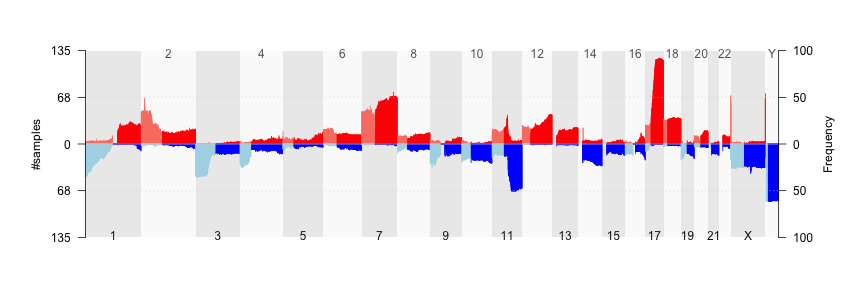
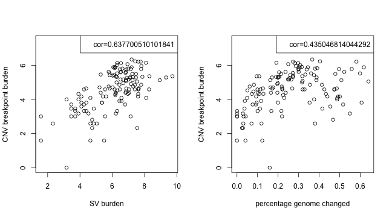
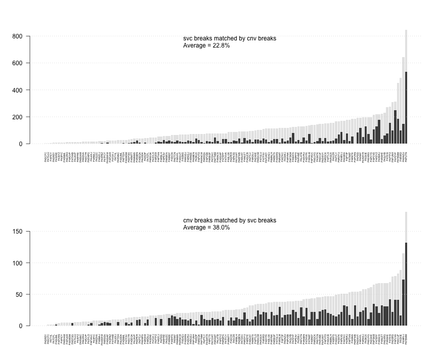
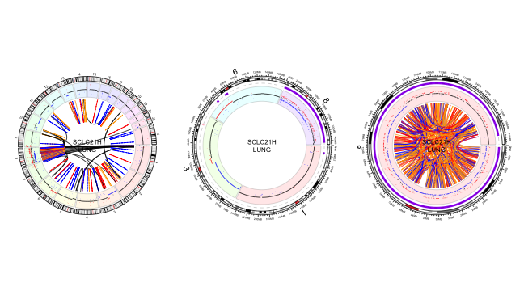
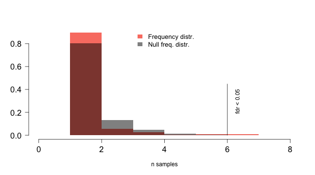
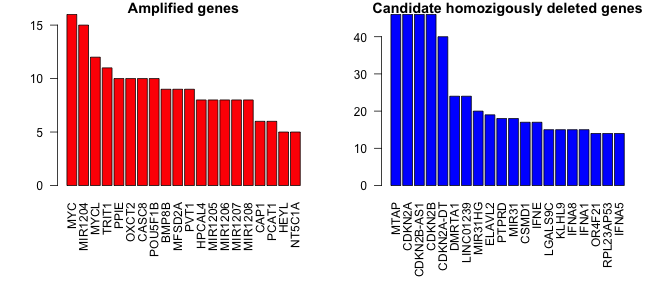
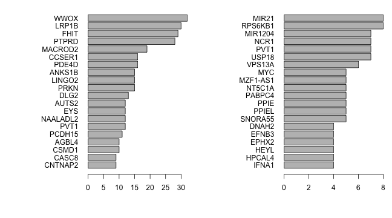
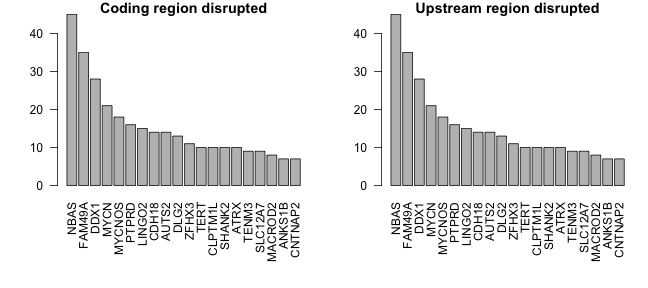

<script type="text/javascript">
document.addEventListener("DOMContentLoaded", function() {
  document.querySelector("h1").className = "title";
});
</script>
<script type="text/javascript">
document.addEventListener("DOMContentLoaded", function() {
  var links = document.links;  
  for (var i = 0, linksLength = links.length; i < linksLength; i++)
    if (links[i].hostname != window.location.hostname)
      links[i].target = '_blank';
});
</script>
<style type="text/css" scoped>
body {
  margin: 0px auto;
  max-width: 1134px;
  font-family: sans-serif;
  font-size: 10pt;
}

/* Table of contents style */

div#TOC ul {
  padding: 0px 0px 0px 45px;
  list-style: none;
  background-image: none;
  background-repeat: none;
  background-position: 0;
  font-size: 10pt;
  font-family: Helvetica, Arial, sans-serif;
}

div#TOC > ul {
  padding: 0px 150px 0px 65px;
  font-size: 12pt;
}

div#TOC > ul > li {
  padding: 5px 0px 0px 0px;
}

div#TOC ul ul {
  font-size: 11pt;
}

div#TOC.tocify ul {
  padding: 0px;
  font-size: inherit;
  font-family: inherit;
}

div#TOC.tocify li {
  padding: 5px;
  font-size: inherit;
  font-family: inherit;
}

p, dl {
  padding: 0px 150px 0px 65px;
  text-align: justify;
}

/* vertical content spacing */
p, img, table {
  margin-top: 10px;
  margin-bottom: 10px;
}

/* lists */
ol, ul {
  padding: 0px 150px 0px 100px;
  list-style: square;
}

li ol, li ul {
  padding: 0px 0px 0px 35px;
}

li p {
  padding: 0;
}

pre {
  margin: 0em 150px 0.5em 0em;
  padding: 0px 0px 0px 65px;
  border: 0px none;
  background-color: #f0f0f0;
  white-space: pre;
  overflow-x: auto;
  font-size: 90%;
}

li pre {
  margin: 0em 0px 0.5em -65px;
  padding: 0px 0px 0px 65px;
}
pre code {
  background-color: inherit;
  display: block;
  padding: 10px 10px 10px 0px;
  overflow-x: inherit;
  font-size: 100%;
}

/* markdown v1 */
pre code[class] {
  background-color: inherit;
}

/* markdown v2 */
pre[class] code {
  background-color: inherit;
}

tt, code, pre {
   font-family: 'DejaVu Sans Mono', 'Droid Sans Mono', 'Lucida Console', Consolas, Monaco, monospace;
}

h1, h2, h3, h4, h5, h6 { 
  font-family: Helvetica, Arial, sans-serif;
  margin: 1.2em 150px 0.6em 0em;
/* hanging headings */
  padding-left: 65px;
  text-indent: -65px;
}

h1.title {
  color: #87b13f;
  line-height: 1.1em;
  margin-top: 25px;
  border-bottom: 0px;
}

h1 {
  line-height: 1.4em;
  border-bottom: 1px #1a81c2 solid;
}

h1, h2, h3 {
  color: #1a81c2;
}

h1 {
  font-size: 18.0pt;
}

h2 {
  font-size: 14.5pt;
}

h3, h4 {
  font-size: 12pt;
}

span.header-section-number {
  float: left;
  width: 65px;
}

/* document header */

p.author-name {
  font-size: 14.5pt;
  font-weight: bold;
  font-style: italic;
  text-align: left;
}

.date {
  text-indent: 0px;
  font-weight: bold;
}

.abstract, .package {
  font-weight: bold;
}

/* formatting of inline code */
code { 
  background-color: #f0f0f0;
  color: #404040;
  font-size: 90%;
}

/* figures */

.figure { 
  margin: 0em 0px 0.5em;
}

img {
  max-width: 100%;
  display: block;
  padding: 0px 150px 0px 130px;
}

p > img {
  padding-left: 65px;
  padding-right: 0px;
}

img.smallfigure {
  padding-left: 195px;
  padding-right: 280px;
}

p > img.smallfigure {
  padding-left: 130px;
  padding-right: 130px;
}

img.widefigure {
  padding-left: 65px;
  padding-right: 85px;
  margin-right: -65px;
}

p > img.widefigure {
  padding-left: 0px;
  padding-right: 0px;
  margin-right: -65px;
}

p.caption, caption {
  color: inherit;
  font-size: 8pt;
}

p.caption {
  padding-left: 130px;
  padding-right: 85px;
  margin-bottom: 20px;
}

caption {
  padding: 0px;
  margin-bottom: 10px;
  min-width: 583;
}
span.caption-title {
  color: #1a81c2;
  font-weight: bold;
}

span.caption-label {
  font-weight: bold;
}

/* tables */

table {
  margin-left: 130px;
  margin-right: 85px;
}

.table {
  max-width: 518px;
}

/* definition lists */

dd {
  margin-left: 65px;
  margin-bottom: 10px;
}

/* code folding buttons */

.code-folding-btn {
  position: relative;
  margin-top: -26px;
  top: 26px;
}

.col-md-12 {
  min-height: 0px;
}

/* footnotes as sidenotes */

.sidenote {
  float: right;
  clear: right;
  margin-right: -150px;
  width: 130px;
  margin-top: 0;
  margin-bottom: 1rem;
  font-size: 8pt;
  line-height: 1.3;
  vertical-align: baseline;
  position: relative;
  text-align: left;
}

.sidenote-number, .affil-mark {
  position: relative;
  vertical-align: super;
  font-size: 7.5pt;
  font-weight: normal;
  font-style: normal;
  line-height: normal;
}

input.margin-toggle { display: none; }

label.sidenote-number { display: inline; }

label.margin-toggle:not(.sidenote-number) { display: none; }

/* Class described in https://benjeffrey.com/posts/pandoc-syntax-highlighting-css
   Colours from https://gist.github.com/robsimmons/1172277 */

code > span.kw { color: #E07020; } /* Function calls */
code > span.dt { color: #404040; } /* Function args */
code > span.dv { color: #D02070; } /* DecVal (decimal values) */
code > span.bn { color: #d14; } /* BaseN */
code > span.fl { color: #D02070; } /* Float */
code > span.ch { color: #40A040; } /* Char */
code > span.st { color: #40A040; } /* String */
code > span.co { color: #808080; font-style: italic; } /* Comment */
code > span.ot { color: #2020F0; } /* Keywords */
code > span.al { color: #ff0000; font-weight: bold; } /* AlertToken */
code > span.fu { color: #E07020; } /* Function calls */ 
code > span.er { color: #FF0000; } /* ErrorTok */

code > span.identifier { color: #404040; }
code > span.number { color: #D02070; }
code > span.string { color: #40A040; }
code > span.comment { color: #808080; font-style: italic; }
code > span.keyword { color: #2020F0; }
code > span.literal { color: #2020F0; }
code > span.operator { color: #000000;}
code > span.paren { color: #000000;}

/* proper positioning of ggplotly graphics, see https://support.bioconductor.org/p/97609/ */

.js-plotly-plot .plotly {
  padding-left: 65px;
}
</style>
  


## svncvplus: R toolkit for the analysis of structural variants and complex genomic rearrangements

`svncvplus` is an R package designed for integrative analyses of somatic DNA copy number variations (CNV) and other structural variants (SV).`svcnvplus` comprises multiple analytical and visualization tools that can be applied to large datasets from cancer patients such as [TCGA](https://www.cancer.gov/about-nci/organization/ccg/research/structural-genomics/tcga) and cencer cell lines [CCLE](https://portals.broadinstitute.org/ccle).
  
CNV data can be derived from genotyping and CGH arrays, as well as next generation sequencing; different segmentation algorithms are used to obtain dosage variations (gains and losses) across the genome. Alternatively SV calls can be inferred from discordantly aligned reads from whole genome sequencing (WGS) using different algorithms (e.g [manta](https://github.com/Illumina/manta)[], [lumpy](https://github.com/arq5x/lumpy-sv), etc).
  
SV calls provide linkage information from discordantly aligned reads and read pairs, allowing the discovery of chromosomal translocations and variants that do not necesarily involve dosage change, such as inversions and insertions. Segmentation CNVs and alignment based SV calls produce orthogonal as well as complementary results. The integration of both data types can by highly informative to understand the somatic alterations driving many cancers and is essential to characterize complex chromosomal alterations such as chromothripsis and chromoplexy.
  
Most currently available cancer genomics datasets incorporate CNV characterization whereas SVs (derived from WGS) are scarcer. For this reason, `svcnvplus` tools implements functions that work with both data types separately as well as integrated.


## Index:

* [Install svcnvplus](#install-svcnvplus)
* [Input data](#input-data)
* [Validate data types](#validate-data-types)
    * [Validate segmentation data format](#validate-segmentation-data-format)
    * [Validate structural variant data format](#validate-structural-variant-data-format)
* [CNV analysys and visualization](#cnv-analysys-and-visualization)
    * [CNV frequency plot](#cnv-frequency-plot)
    * [Chromosome arm CNV determination](#chromosome-arm-cnv-determination)
* [Assesment of chromosomal instability](#assesment-of-chromosomal-instability)
    * [Percent genome change](#percent-genome-change)
    * [Breakpoint burden analysis](#breakpoint-burden-analysis)
* [Co-localization of breakpoints](#co\-localization-of-breakpoints)
* [Identification of shattered regions](#identification-of-shattered-regions)
    * [Chromosome shattering combining SV and CNV](#chromosome-shattering-using-sv-and-cnv)
    * [Chromosome shattering using CNV data only](#chromosome-shattering-using-cnv-data-only)
    * [Visualization of shattered regions](#visualization-of-shattered-regions)
    * [Recurrently shattered regions](#recurrently-shattered-regions)
* [Recurrently altered genes](#recurrently-altered-genes)
    * [Gene level CNV](#gene-level-cnv)
    * [Recurrently altered genes overlapping with CNV breakpoints](#recurrently-altered-genes-overlapping-with-cnv-breakpoints)
    * [Recurrently altered genes overlapping with structural variants](#recurrently-altered-genes-overlapping-with-sv-breakpoints)

------------

## Install svcnvplus

Install development version from GitHub

```r
devtools::install_github("gonzolgarcia/svcnvplus")
```

## Input data

Two data types are allowed:
  
__CNV segmentation data:__ 6 columns are required in the folowing order: `sample`, `chrom`, `start`, `end`, `probes` & `segmean`. Most algorithms studying CNVs produce segmented data indicating genomic boundaries and the segment mean copy number value (segmean); `svcnvplus` assumes CNV expresed as log-ratios: __e.g.:__ $\log2(tumor/normal)$ Those values do not necesarily represent entire copy number states as many samples may contain admixture or subclonal populations.
  
__Structural Variant calls:__ 8 columns are required in the folowing order: `sample`, `chrom1`, `pos1`, `strand1`, `chrom2`, `pos2`, `strand2` & `svclass`. SV calls are obtained from WGS by identifying reads and read-pairs that align discordantly to the reference genome. The types accepted in the svclass field are: duplication(DUP), deletion(DEL), inversion(INV), insertion(INS), translocation(TRA) and breakend(BND) for undefined variants.
  
All functions accept multiple samples. Functions that make use of both CNV and SV calls expect a common set of ids in the `sample` field.
  
In order to explore the  functionalities of svcnvplus, two datasets have been included with the package:
  
* CCLE lung cancer derived cell lines <https://depmap.org/portal/download/>; Two data.frames contain information about CNV segments and structural variants respectively:
    * `svcnvplus::segdat_lung_ccle`
    * `svcnvplus::svdat_lung_ccle`
* [TARGET neuroblastoma dataset](https://ocg.cancer.gov/programs/target) based on Complete Genomics WGS and structural variant calls:
    * `svcnvplus::nbl_segdat`
    * `svcnvplus::nbl_svdat`  
Both datasets are `lazy` loaded with `svcnvplus`


```r
library(svcnvplus)
head(nbl_segdat)
```

```
##   Sample Chromosome    Start      End Num_markers  Seg_CN
## 1 PAISNS          1    11000   833000         337 -0.0270
## 2 PAISNS          1   835000  2715000         916 -1.0257
## 3 PAISNS          1  2717000  5969000        1552 -0.8316
## 4 PAISNS          1  5971000 12481000        3256 -0.9593
## 5 PAISNS          1 12483000 12777000         148 -0.2305
## 6 PAISNS          1 12779000 15551000        1287 -0.0083
```

```r
head(nbl_svdat)
```

```
##   TARGET.USI LeftChr LeftPosition LeftStrand RightChr RightPosition RightStrand Type
## 1     PAISNS    chr1     12481576          -     chr7     123358964           +  TRA
## 2     PAISNS    chr1    120543859          -     chr2      65103235           -  TRA
## 3     PAISNS    chr2    231680218          +    chr21      40045998           +  TRA
## 4     PAISNS    chr3     54814482          -    chr17      42657036           +  TRA
## 5     PAISNS    chr4     97761321          -     chr4      97765146           +  INV
## 6     PAISNS    chr4    190936134          +     chr9      68411170           +  TRA
```

## Validate data types

* `validate.seg()` segmentation data.frame parser
* `validate.sv()` structural variant data.frame parser

### Validate segmentation data format

Validate and reformat CNV segmentation `data.frame` to be used by svcnvplus tools


```r
segdf <- validate.seg(nbl_segdat)
head(segdf)
```

```
##   sample chrom    start      end probes segmean
## 1 PAISNS  chr1    11000   833000    337 -0.0270
## 2 PAISNS  chr1   835000  2715000    916 -1.0257
## 3 PAISNS  chr1  2717000  5969000   1552 -0.8316
## 4 PAISNS  chr1  5971000 12481000   3256 -0.9593
## 5 PAISNS  chr1 12483000 12777000    148 -0.2305
## 6 PAISNS  chr1 12779000 15551000   1287 -0.0083
```


### Validate structural variant data format 

Validate and format structural variant `data.frame` to be used by svcnvplus tools


```r
svdf <- validate.sv(nbl_svdat)
head(svdf)
```

```
##   sample chrom1      pos1 strand1 chrom2      pos2 strand2 svclass
## 1 PAISNS   chr1  12481576       -   chr7 123358964       +     TRA
## 2 PAISNS   chr1 120543859       -   chr2  65103235       -     TRA
## 3 PAISNS   chr2 231680218       +  chr21  40045998       +     TRA
## 4 PAISNS   chr3  54814482       -  chr17  42657036       +     TRA
## 5 PAISNS   chr4  97761321       -   chr4  97765146       +     INV
## 6 PAISNS   chr4 190936134       +   chr9  68411170       +     TRA
```

## CNV analysys and visualization

### CNV frequency plot

Visualization of CNV gain/loss frequencies across the genome; aggregates samples for a given genomic window size, which copy number log-ratio differs from 0. The thresshold `fc.pct` is represented as percentage (e.g. 0.2 -> 20% fold change compared to the referece).


```r
cnv_freq <- cnv.freq.plot(segdf, fc.pct = 0.2)  # plot cnv frequencies
```




```r
head(cnv_freq$freqsum)  # data.frame contains every genomic bin 
```

```
##                       chr   start     end freq.gains freq.loss
## chr1_11000_1011000   chr1   11000 1011000 0.02962963 0.3333333
## chr1_1011000_2011000 chr1 1011000 2011000 0.02962963 0.3333333
## chr1_2011000_3011000 chr1 2011000 3011000 0.02222222 0.3333333
## chr1_3011000_4011000 chr1 3011000 4011000 0.02222222 0.3333333
## chr1_4011000_5011000 chr1 4011000 5011000 0.02222222 0.3407407
## chr1_5011000_6011000 chr1 5011000 6011000 0.02222222 0.3407407
```


### Chromosome arm CNV determination

The function `chr.arm.cnv` obtains the segment weighted average log-ratios for each chromosome arm ans sample; it return in a matrix formated output.


```r
charm.mat <- chr.arm.cnv(segdf, genome.v = "hg19", verbose = FALSE)
require(gplots,quietly = TRUE,warn.conflicts = FALSE)

# heatmap plot of chromosome arm level CNV
heatmap.2(charm.mat[order(rownames(charm.mat))[1:42],],Rowv=NA,trace='none',cexCol=.5, lhei=c(0.25,1), dendrogram='col', key.title="Copy number",
        col=colorRampPalette(c("blue","white","red"))(256))
```


## Assesment of chromosomal instability

Chromosomal instability (CIN) is common in cancer and has a fundamental pathogenic role. CNV profiles allow quantification of this events by evaluating the percentage of the genome  copy number differing from diploid or the burden of genomic alterations in a given sample.

### Percent genome change

Per sample measure of genome instability; calculates what percentage of the genome's copy number log2-ratio differs from 0 (aka. diploid for autosomal chromosomes) above a certain threshold.


```r
pct_change <- pct.genome.changed(segdf, fc.pct = 0.2)
```

### Breakpoint burden analysis

In addition to percentage of genome changed, we can measure the total burden of breakpoints derived from CNV segmention and SV calls. Both the percent genome change and breakpoint burden measures are expected to show positive correlation.


```r
# define breakpoints from SV data
sv_breaks  <- sv.breaks(svdf)  

# define breakpoints from seg data based on certain CNV log-ratio change cutoff
cnv_breaks  <- seg.breaks(segdf,fc.pct = 0.2,verbose=FALSE)  

# scatter plot comparing CNV and SV breakpoint burden and percent genome changed, for a set of common samples
common_samples <- intersect(names(sv_breaks$brk.burden),names(cnv_breaks$brk.burden))

dat1 <- log2(1+cbind(sv_breaks$brk.burden[common_samples],
                    cnv_breaks$brk.burden[common_samples]))

dat2 <- log2(1+cbind(pct_change, 
                     cnv_breaks$brk.burden[names(pct_change)]))

par(mfrow=c(1,2))
plot(dat1, xlab="SV burden", ylab="CNV breakpoint burden")
legend("topright",paste("cor=",cor(dat1)[1,2], sep=""))
plot(dat2, xlab="percentage genome changed", ylab="CNV breakpoint burden")
legend("topright",paste("cor=",cor(dat2)[1,2], sep=""))
```



## Co-localization of breakpoints

Both CNV segmentation profiles and SV calls produce orthogonal results for variants that involve dosage changes (duplications and deletions). The function `match.breaks` compares the breakpoints derived from both approaches by identifying their co-localizing. This function can also be used to compare two sets of CNV brekpoints obtaind from different algorithms or SV callers since the format of both CNV and SV breaks objects have the same format within `svcnvplus`.


```r
common.breaks <- match.breaks(cnv_breaks, sv_breaks, 
                              maxgap=50000, verbose=FALSE)

# average percentage of colocalizing breaks
restab <- data.frame(common.breaks$restab)[order(common.breaks$restab$total.brk2),]
m2 <- sprintf("%.1f",100*mean(restab$matched.brk2/restab$total.brk2)) 

# Plot the proportion of SV breakpoints that have colocalizing CNV breakpoints
barplot(rbind(restab$matched.brk2, restab$total.brk2 - restab$matched.brk2),
        border=NA,las=2,xlab="",horiz=FALSE,cex.main=.7,cex.names=.4, names=rownames(restab))
legend("top",paste("SV breaks matched by CNV breaks\n","Average = ",m2,"%",sep=""),bty='n')
grid(ny=NULL,nx=NA)
```




## Identification of shattered regions

Complex chromosomal rearrangements such as chromothripsis and chromoplexy are widespread events in many cancers and may have important pathogenic roles. `svcnvplus` incorporates tools to map and visualize shattered regions across multiple samples.

We used LUNG cancer cell line profiles from the CCLE in order to illustrate these tools:

Validate segmentation and SV data.frames

```r
segdf <- validate.seg(segdat_lung_ccle)
svdf <- validate.sv(svdat_lung_ccle)
```

### Chromosome shattering combining SV and CNV 

1) Identification of genomic bins with high density of breakpoints
    * The genome is binned into 10Mb windows (`window.size == 10`) and slide into 2Mb (`slide.size == 2`).
    * Breakpoints are defined using `seg.breaks` (CNV), `sv.breaks` (SV) and `match.breaks` (common) and then mapped into bins; minimum thresholds are set using `num.seg.breaks = 6`, `num.sv.breaks = 6` and `num.common.breaks = 3` respectively.
    * The number of breaks must be of shattered regions are spected to be out-liers therefor the n times above the average in each sample can be defined using `num.seg.sd = 5`, `num.sv.sd = 5` and `num.common.sd = 0`

2) Identification if shattered regions
    * Contiguous bins with high density of breakpoints are collapsed into shattered regions
    * To discard complex focal events such as circular amplifications or double minutes, the interquartile average of the distances between breaks is set to `dist.iqm.cut = 150000`.
    * Finaly shattered regions such as chromothripsis and chromoplexy produce interleaved SVs. We set the percentage of interleaved SVs with `interleaved.cut = 0.33` to discard regions with less than 33% interleaved variants.

(more info `?shattered.regions`)


```r
shatt_lung <- shattered.regions(segdf, svdf, fc.pct = 0.05,  min.num.probes = 3, clean.brk = 4,
                                window.size = 10, slide.size = 2, num.seg.breaks = 6, 
                                num.seg.sd = 5, num.sv.breaks = 6, num.sv.sd = 5, 
                                num.common.breaks = 2, num.common.sd = 0, interleaved.cut = 0.33,
                                dist.iqm.cut = 100000,verbose=FALSE)
shatt_lung$regions.summary$NCIH522_LUNG
```

```
##   chrom     start       end nseg links reg.size dist.iqm.seg dist.iqm.sv n.brk.seg n.brk.sv n.orth.seg n.orth.sv interleaved conf
## 1  chr2 184162747 192989418    3     -  1.4e+07     393135.8   535717.60        13       10          6         6  0.80000000   lc
## 2  chr6  10394318  28148876    6   3,4  2.0e+07     389333.0    57651.52        19       46         14        16  0.15151515   HC
## 3  chr6  39012920  45302501    2   2,4  1.2e+07     204034.0   157078.00         9       13          5         6  0.00000000   HC
## 4  chr6  53985510  70945739    7   2,3  2.2e+07     173605.7    71656.24        29       52         19        24  0.12195122   HC
## 5 chr21  10994075  47273167   15     -  3.8e+07     294867.9   267349.74        65       67         31        34  0.08333333   HC
```

### Chromosome shattering using CNV data only

A simplified version of `shattered regions` uses only CNV segmentation data, which is available in more often and in larger datasets. The `shattered.regions.cnv` follows the same approach but disregards parameters that are only available for SV data.


```r
shatt_lung_cnv <- shattered.regions.cnv(segdf, fc.pct = 0.2, clean.brk = 4, window.size = 10,
                                        min.num.probes = 3, slide.size = 2,num.breaks = 8, 
                                        num.sd = 5, dist.iqm.cut = 150000,verbose=FALSE)
shatt_lung_cnv$regions.summary$A549_LUNG
```

```
##   chrom     start       end nseg dist.iqm n.brk conf
## 1  chr1 110206904 112706144    5 115758.5     9   lc
## 2  chr3    377402  16241354    6 466057.7    22   HC
## 3  chr4 168970791 176576580    1 778410.0     8   HC
## 4  chr6  25347255  32530221    1 166325.0     8   HC
## 5  chr7 134278307 149847513    3 143582.3    13   lc
## 6 chr15  20586232  30894417    2 690287.2    10   HC
```
 
### Visualization of shattered regions

Circos plotting is available via [circlize](https://cran.r-project.org/web/packages/circlize/index.html) package wrapper function  `circ.chromo.plot`, which takes an object generated by `shattered.regions` function. The circular plot represents (inward to outward): Structural variants, CNVs, shattered regions (purple) and the ideogram. 


```r
par(mfrow=c(1,2))
circ.chromo.plot(shatt_lung,sample.id = "SCLC21H_LUNG")
circ.chromo.plot(shatt_lung,sample.id = "NCIH510_LUNG")
```




### Recurrently shattered regions

To establish whether certain regions suffer chromosome shatter-ing above expectation, we evaluate the null hypothesis that shat-tered regions occur throughout the genome at random; To this end we first create an empirical null distribution based on the sample set under study. The null is then compared with the ob-served distribution (`shatt_lung_cnv$high.density.regions.hc`) to obtain empirical adjusted p-values. The bins with corrected p-values deemed statistically significant define regions under selection pressure for chromosome shattering. Since the genomic bins might span low coverage regions where no CNV or SVs are mapped we removed remove bins with frequancy = 0 detting the `zerofreq=TRUE`.


```r
null.test <- freq.p.test(shatt_lung_cnv$high.density.regions.hc, method="bonferroni", p.cut = 0.05, iter = 100, zerofreq=TRUE)

# Compare observed frequencies versus the null distribution of recurrently shattered regions; 
# the histogram bars represent proportion of genomic bins for each ginven number of samples found shattered

hist(null.test$observed, ylim=c(0,0.25), col='salmon', border="white", 
     breaks=30,las=1,cex.axis=1.4,ylab="",prob = TRUE,main="",xlab="n samples")
hist(null.test$null, breaks=15,add=T,col=scales::alpha('black',.5), 
     border="white",prob = TRUE)
legend(10,0.24,c("Frequency distr.","Null freq. distr."),
       fill=c('salmon',scales::alpha('black',.5)),border=NA,bty='n',cex=1.1)
lines(c(null.test$freq.cut,null.test$freq.cut),c(0,0.15))   # cutoff for statistical significance
text(null.test$freq.cut+0.5,0.07,"Bonferroni < 0.05",srt=90)
```



We can visualize the aggregate map of shattered regions for all samples with `shattered.map.plot`. The peaks that rise above `null.test$freq.cut` define recurrently shattered regions


```r
shattered.map.plot(shatt_lung_cnv, fdr = null.test$freq.cut)
```


And finally collect groups of samples with recurrent shattered regions as defined by the empirical test described above. 


```r
# obtain genomic bins within above the FDR cutoff
freq.matrix <- apply(shatt_lung_cnv$high.density.regions.hc,2,sum)
textRegions <- names(which(freq.matrix >= null.test$freq.cut))
hitRegions <- remove.factors((data.frame(do.call(rbind,strsplit(textRegions," ")))))
hitRegions[,2] <- as.numeric(hitRegions[,2])
hitRegions[,3] <- as.numeric(hitRegions[,3])
colnames(hitRegions) <- c("chr","start","end")
rownames(hitRegions) <-textRegions

# collapes contiguous bins into unique regions
bins2remove <- c()
for(i in 2:nrow(hitRegions)){ 
  if(hitRegions[i,"chr"] == hitRegions[i-1,"chr"] ){
    if(hitRegions[i,"start"] < (hitRegions[i-1,"end"])){
      hitRegions[i,"start"] <- hitRegions[i-1,"start"]
      bins2remove <- c(bins2remove,textRegions[i-1])
    }
  }
}
hitRegionsPost<- hitRegions[setdiff(rownames(hitRegions),bins2remove),]

require(GenomicRanges)
hitRegions_gr <- with(hitRegions, GRanges(chr, IRanges(start=start, end=end)))
hitRegionsPost_gr <- with(hitRegionsPost, GRanges(chr, IRanges(start=start, end=end)))
hits <-GenomicAlignments::findOverlaps(hitRegionsPost_gr,hitRegions_gr)

regList <- list()
for(i in unique(queryHits(hits))) regList[[paste(hitRegionsPost[i,],collapse=" ") ]] <- textRegions[subjectHits(hits)[which(queryHits(hits) == i)]]

# obtain the genomic bins with maximum number of samples
regListPeak <- lapply(regList, function(x) 
    names(which(freq.matrix[x] == max(freq.matrix[x]))))
# collect samples with shattered region in the peaks 
regListPeakSamples <- lapply(regListPeak, function(x) 
    names(which(apply(cbind(shatt_lung_cnv$high.density.regions.hc[,x]),1,sum) > 0)))
```

Beyond this point the user can perform case/control hipothesys for chromosome shattering of specific genomic regions within the dataset under study.


## Recurrently altered genes

Somatic pathogenic variants are characterized by presenting in recurrent patterns. Evaluating the recurrence of structural variations involve challenges as their interpretation more complicated than other variant types (e.g. SNVs). We evaluate the recurrence of structural variants using two criteria: dosage changes at the gene level and analysis of breakpoints overlapping with known genes.

### Gene level CNV

Generates a matrix with gene level CNVs from a segmentation file and obtain the ranking of amplifications and deep deletions (cutoff = 2 => * copies; -2 => 0.5 copies).


```r
segdf_clean <- clean.cnv.artifact(segdf, verbose=FALSE,n.reps = 4)  # remove likely artifacts from segmentation data
gene_cnv <- gene.cnv(segdf_clean,genome.v = "hg19",fill.gaps = TRUE,verbose=FALSE)
amplified <- apply(gene_cnv$cnvmat, 1, function(x) which(x > 2))
deepdel <- apply(gene_cnv$cnvmat, 1, function(x) which(x < -2))
```


```r
par(mfrow=c(1,2),mar=c(4,7,1,1))
barplot(sort(unlist(lapply(amplified,length)),decreasing=TRUE)[20:1],col="red",
        las=1,main="Amplified genes",horiz=TRUE,xlab="#samples")
barplot(sort(unlist(lapply(deepdel,length)),decreasing=TRUE)[20:1],col="blue",
        las=1,main="Candidate homozigously deleted genes",horiz=TRUE,xlab="#samples")
```



### Recurrently altered genes overlapping with CNV breakpoints

Instead of focusing on high-level dosage changes, we evaluate whether CNV breakpoints overlap with known genes or upstream regions (gene level CNVs are studied [above](#gene-level-cnv)). `cnv.break.annot` evaluates segmentation data and returns a list of genes and associated breakpoints that can be retrieved for further analyses. In addition every gene is associated via list to the sample ids harboring the variants.


```r
results_cnv <- cnv.break.annot(segdf_clean, fc.pct = 0.2, genome.v="hg19",clean.brk = 8,upstr = 50000,verbose=FALSE)

# plot a ranking of recurrently altered genes
par(mfrow=c(1,2),mar=c(4,7,1,1))
barplot(sort(unlist(lapply(results_cnv$disruptSamples,length)),decreasing=TRUE)[20:1],
        las=1,main="Gene coding region disrupted",horiz=TRUE,xlab="#samples")
barplot(sort(unlist(lapply(results_cnv$upstreamSamples,length)),decreasing=TRUE)[20:1],
        las=1,main="Gene upstream region disrupted",horiz=TRUE,xlab="#samples")
```



### Recurrently altered genes overlapping with structural variants calls

SV calls do not incorporate dosage information, therefore we study the localization of breakpoints with respect to known genes. The annotation identifies small segmental variants overlapping with genes. For translocations (TRA) and large segmental variants (default > 200Kb) only the breakpoint overlap with genes are considered. `sv.break.annot` returns a list of genes and associated variants that can be retrieved for further analyses. In addition, every gene is associated via list to the sample ids harboring variants.


```r
results_sv <- sv.break.annot(svdf, sv.seg.size = 200000, genome.v="hg19",upstr = 50000, verbose=FALSE)

# plot a ranking of recurrently altered genes
par(mfrow=c(1,2),mar=c(4,7,1,1))
barplot(sort(unlist(lapply(results_sv$disruptSamples,length)),decreasing=TRUE)[20:1],
        las=1,main="Coding region disrupted",horiz=TRUE,xlab="#samples")
barplot(sort(unlist(lapply(results_sv$upstreamSamples,length)),decreasing=TRUE)[20:1],
        las=1,main="Upstream region disrupted",horiz=TRUE,xlab="#samples")
```




